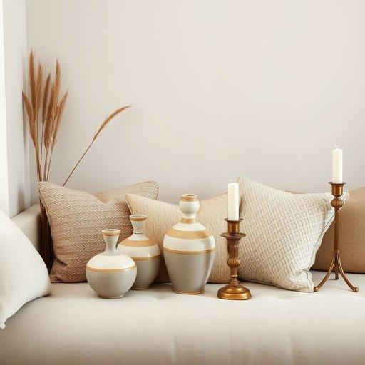

# homeware

<h1 style="font-size: 2.5em; font-weight: 300; letter-spacing: 2px; margin: 0; color: #2c3e50;">
/homeware*/
</h1>

---

---

## 例句

When we redecorated the living room last month, I spent hours browsing through various homeware collections, ranging from handcrafted ceramic vases to intricately patterned cushions and elegant candle holders, all of which perfectly complemented the vintage aesthetic we were aiming for.

*When(/wɪn/) we(/wi/) redecorated(/riˈdɛkərˌeɪtɪd/) the(/ðə/) living(/ˈlɪvɪŋ/) room(/rum/) last(/læst/) month,(/mənθ,/) I(/aɪ/) spent(/spɛnt/) hours(/aʊərz/) browsing(/ˈbraʊzɪŋ/) through(/θru/) various(/ˈvɛriəs/) homeware(/homeware*/) collections,(/kəˈlɛkʃənz,/) ranging(/ˈreɪnʤɪŋ/) from(/frəm/) handcrafted(/ˈhændˌkræftɪd/) ceramic(/sərˈæmɪk/) vases(/ˈvɑzɪz/) to(/tɪ/) intricately(/ˈɪntrəkətli/) patterned(/ˈpætərnd/) cushions(/ˈkʊʃənz/) and(/ənd/) elegant(/ˈɛləgənt/) candle(/ˈkændəl/) holders,(/ˈhoʊldərz,/) all(/ɔl/) of(/əv/) which(/wɪʧ/) perfectly(/ˈpərfəktli/) complemented(/ˈkɑmpləˌmɛntɪd/) the(/ðə/) vintage(/ˈvɪntɪʤ/) aesthetic(/ɛsˈθɛtɪk/) we(/wi/) were(/wər/) aiming(/ˈeɪmɪŋ/) for.(/fər./)*

**翻译：** 上个月我们重新装修客厅时，我花了数小时浏览各种家居用品，从手工制作的陶瓷花瓶到图案精美的抱枕，再到优雅的烛台，这些都完美契合了我们追求的复古美学。

---

## 解释

英语单词“homeware”作为名词，通常指的是用于家庭生活中的各类实用物品，如厨房用具、餐具、床上用品、浴室用品及其他家居装饰或功能性用品，广泛应用于家居用品商店、购物指南、产品描述等语境中。英语学习者在使用“homeware”时应注意它是一个不可数名词，通常以单数形式出现，且常与形容词连用如“kitchen homeware”（厨房用品）或用于复数形式“homewares”以强调多样品类；此外，该词常与动词如“buy,” “sell,” “stock”搭配，表达购买、销售或库存家用商品。词源上，“homeware”由“home”（家）和“ware”（商品、器具）合成，ware源自古英语“waru”，意为物品、商品，整体指家庭相关的商品。中文语境中，“homeware”准确翻译为“家居用品”或“家用器具”，强调其在家庭生活中的实用性和多样性，通常不带褒贬色彩，属于中性词；然而，文化上“homeware”往往暗示产品既有功能性又兼具一定审美价值，反映当代对生活品质和居家氛围的重视。因此，理解“homeware”不仅关注其物理属性，也应涵盖其在家庭生活场景中的实用与美学双重意义。

---

<small style="color: #999; font-size: 0.9em;">2025-07-17 06:22:40</small>

