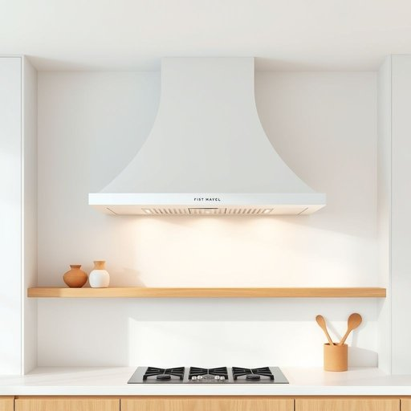

# hood

<h1 style="font-size: 2.5em; font-weight: 300; letter-spacing: 2px; margin: 0; color: #2c3e50;">
/hʊd/
</h1>

---

---

## 例句

Before the meeting began, the filter was examined thoroughly to ensure the kitchen hood would function optimally, preventing any smoke or steam from lingering and making the atmosphere uncomfortable.

*Before(/ˌbiˈfɔr/) the(/ðə/) meeting(/ˈmitɪŋ/) began,(/bɪˈgæn,/) the(/ðə/) filter(/ˈfɪltər/) was(/wɑz/) examined(/ɪgˈzæmənd/) thoroughly(/ˈθəroʊli/) to(/tɪ/) ensure(/ɪnˈʃʊr/) the(/ðə/) kitchen(/ˈkɪʧən/) hood(/hʊd/) would(/wʊd/) function(/ˈfəŋkʃən/) optimally,(/optimally*,/) preventing(/prɪˈvɛnɪŋ/) any(/ˈɛni/) smoke(/smoʊk/) or(/ər/) steam(/stim/) from(/frəm/) lingering(/ˈlɪŋgərɪŋ/) and(/ənd/) making(/ˈmeɪkɪŋ/) the(/ðə/) atmosphere(/ˈætməsˌfɪr/) uncomfortable.(/ənˈkəmfərtəbəl./)*

**翻译：** 会议开始前，滤网经过全面检查，以确保厨房排烟罩能够高效运行，避免烟雾或蒸汽滞留，保持空气清新舒适。

---

## 解释

在家居生活用品的语境中，英语单词"hood"作为名词主要指的是厨房中的抽油烟机罩或排风罩，用于覆盖炉灶上方以排出烹饪产生的烟雾和油烟，这种用法多见于厨房装修、家电安装或清洁维护的场合。学习者在使用"hood"时应注意其作为可数名词，需要与适当的冠词搭配，如“a kitchen hood”或“the hood above the stove”，且常与动词如“install”（安装）、“clean”（清洁）、“turn on/off”（开关）等搭配使用，常见表达还有“range hood”即“炉灶抽油烟机”的全称。词源上，“hood”源自古英语“hōd”，原指头部覆盖物或头巾，逐渐引申为覆盖物的通称，因此在家居用品中借指覆盖或保护特定部位的罩子。中文中，“hood”在此场景下准确翻译为“油烟机罩”或“抽油烟罩”，强调其遮盖和排烟功能。需要注意的是，"hood"在其他语境中还有“兜帽”、“社区”等意思，因此在家居用品领域应结合上下文避免混淆。此词本身无明显褒贬色彩或文化内涵，但其专业指代使其使用较为正式和技术性，适合家居装修和家电领域的表达。

---

<small style="color: #999; font-size: 0.9em;">2025-07-17 06:22:40</small>

