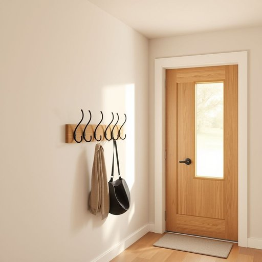

# hook

<h1 style="font-size: 2.5em; font-weight: 300; letter-spacing: 2px; margin: 0; color: #2c3e50;">
/hʊk/
</h1>

---

---

## 例句

Could you please hang your coat on the hook by the door, which is specially designed with multiple curved prongs to hold not only coats but also hats and scarves, so that the hallway stays tidy and free from clutter?

*Could(/kʊd/) you(/ju/) please(/pliz/) hang(/hæŋ/) your(/jʊr/) coat(/koʊt/) on(/ɔn/) the(/ðə/) hook(/hʊk/) by(/baɪ/) the(/ðə/) door,(/dɔr,/) which(/wɪʧ/) is(/ɪz/) specially(/ˈspɛʃəli/) designed(/dɪˈzaɪnd/) with(/wɪθ/) multiple(/ˈməltəpəl/) curved(/kərvd/) prongs(/prɔŋz/) to(/tɪ/) hold(/hoʊld/) not(/nɑt/) only(/ˈoʊnli/) coats(/koʊts/) but(/bət/) also(/ˈɔlsoʊ/) hats(/hæts/) and(/ənd/) scarves,(/skɑrvz,/) so(/soʊ/) that(/ðət/) the(/ðə/) hallway(/ˈhɔlˌweɪ/) stays(/steɪz/) tidy(/ˈtaɪdi/) and(/ənd/) free(/fri/) from(/frəm/) clutter?(/ˈklətər?/)*

**翻译：** 请您将外套挂在门旁的挂钩上，该挂钩特别设计有多根弯曲的挂臂，不仅能挂外套，还能挂帽子和围巾，以此保持走廊整洁，避免凌乱。

---

## 解释

在家居生活用品的语境中，英语单词“hook”作为名词主要指用于悬挂物品的小挂钩，常见于墙壁、门后、衣柜或浴室中，用于挂衣服、毛巾、钥匙或其他轻便物品。这一场合常见的表达包括“coat hook”（衣帽钩）、“towel hook”（毛巾钩）等。英语学习者在使用“hook”时应注意其单复数形式（hook/hooks），且通常见作可数名词，且可与介词连用形成固定搭配，如“on the hook”（挂着）。“Hook”作为名词时，不具备时态变化，但需注意区分其作为动词的用法。词源上，“hook”源自古英语“hoc”，意为弯曲之物，最初指弯曲的钢铁或木制工具，后引申为各种钩形物体。中文语境中，“hook”在家居用品中最准确的翻译为“挂钩”、“钩子”，表达的是一个用来挂东西的弯曲或突起部件，含义中性，无褒贬色彩。在文化上，挂钩象征着整理和收纳的便利，并无特殊文化内涵。总的来说，理解“hook”作为名词时的具体功能和常见搭配，有助于学习者在实际生活交流中准确表达和理解相关家居物品。

---

<small style="color: #999; font-size: 0.9em;">2025-07-17 06:22:40</small>

