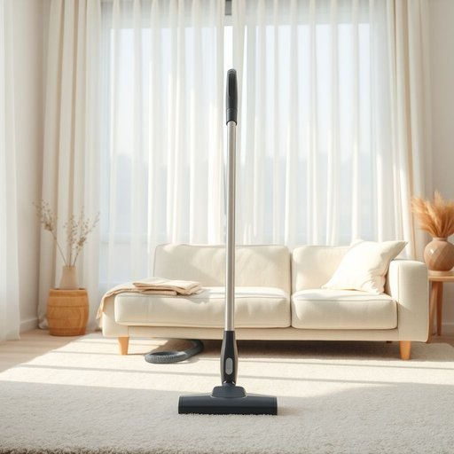

# hoovers

<h1 style="font-size: 2.5em; font-weight: 300; letter-spacing: 2px; margin: 0; color: #2c3e50;">
/hoovers*/
</h1>

---

---

## 例句

Whenever the guests leave, Mum insists that we put away the hoovers, which, despite being bulky and somewhat noisy, are essential for keeping the carpets spotless and free from dust, allergens, and pet hair throughout the house.

*Whenever(/wɛˈnɛvər/) the(/ðə/) guests(/gɛsts/) leave,(/liv,/) Mum(/məm/) insists(/ˌɪnˈsɪsts/) that(/ðət/) we(/wi/) put(/pʊt/) away(/əˈweɪ/) the(/ðə/) hoovers,(/hoovers*,/) which,(/wɪʧ,/) despite(/dɪˈspaɪt/) being(/biɪŋ/) bulky(/ˈbəlki/) and(/ənd/) somewhat(/ˈsəmˈwət/) noisy,(/ˈnɔɪzi,/) are(/ər/) essential(/ɛˈsɛnʃəl/) for(/fər/) keeping(/ˈkipɪŋ/) the(/ðə/) carpets(/ˈkɑrpəts/) spotless(/ˈspɑtləs/) and(/ənd/) free(/fri/) from(/frəm/) dust,(/dəst,/) allergens,(/ˈælərʤənz,/) and(/ənd/) pet(/pɛt/) hair(/hɛr/) throughout(/θruaʊt/) the(/ðə/) house.(/haʊs./)*

**翻译：** 每当客人离开时，妈妈都会坚持让我们收好吸尘器。尽管它们体积庞大且声音有些响，但对于保持整个房子的地毯洁净无尘、无过敏源和无宠物毛发却是必不可少的。

---

## 解释

英语单词“hoovers”作为名词在家居生活用品的语境中，通常特指吸尘器，尤其是在英国英语中，这一词汇具有较强的通用意义。具体使用场合多见于谈论家庭清洁时，例如描述使用吸尘器进行地毯、地板和家具清洁的动作或工具时。“Hoovers”原本是品牌名Hoover公司的商标吸尘器名称，但在英国，常被泛指任何品牌的吸尘器，类似于“胶带”泛指透明胶带的用法；因此，这个词有一定的专有名称变通用名词的特点。英语学习者在使用时需注意，“hoover”作为名词一般作为复数“hoovers”出现，表示多个吸尘器，但在口语中单数“a hoover”也十分常见；作为动词时表示“用吸尘器吸尘”，此时为动词形式需注意时态变化，如“hoovers the carpet”。关于词源，“Hoover”来自于20世纪初创立的Hoover公司，该品牌开创了现代吸尘器市场，从而品牌名演变为常用词。中文中，“hoovers”准确翻译为“吸尘器”，这一翻译完全贴切该词在生活中的用途和功能，没有褒贬色彩，属于中性词汇，使用时应避免误解为专指某一品牌，而应根据具体语境理解为吸尘设备的通称。总体而言，“hoovers”体现了品牌名称泛化为普通名词的语言现象，具有一定的文化特色，但并无明显的情感倾向。

---

<small style="color: #999; font-size: 0.9em;">2025-07-17 06:22:40</small>

