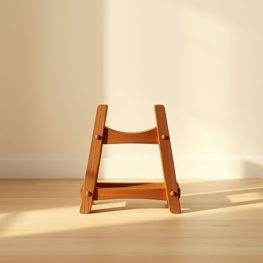

# horse

<h1 style="font-size: 2.5em; font-weight: 300; letter-spacing: 2px; margin: 0; color: #2c3e50;">
/hɔrs/
</h1>

---

---

## 例句

While dusting the shelves in our living room, I found the small, intricately carved wooden horse that my grandmother gave me years ago, which, despite its delicate appearance, has become one of my favourite decorative pieces because it reminds me of the countryside visits we took every summer when I was a child.

*While(/waɪl/) dusting(/ˈdəstɪŋ/) the(/ðə/) shelves(/ʃɛlvz/) in(/ɪn/) our(/ɑr/) living(/ˈlɪvɪŋ/) room,(/rum,/) I(/aɪ/) found(/faʊnd/) the(/ðə/) small,(/smɔl,/) intricately(/ˈɪntrəkətli/) carved(/kɑrvd/) wooden(/ˈwʊdən/) horse(/hɔrs/) that(/ðət/) my(/maɪ/) grandmother(/ˈgrændˌməðər/) gave(/geɪv/) me(/mi/) years(/jɪrz/) ago,(/əˈgoʊ,/) which,(/wɪʧ,/) despite(/dɪˈspaɪt/) its(/ɪts/) delicate(/ˈdɛləkət/) appearance,(/əˈpɪrəns,/) has(/həz/) become(/bɪˈkəm/) one(/wən/) of(/əv/) my(/maɪ/) favourite(/ˈfeɪvərɪt/) decorative(/ˈdɛkrətɪv/) pieces(/ˈpisɪz/) because(/bɪˈkəz/) it(/ɪt/) reminds(/riˈmaɪndz/) me(/mi/) of(/əv/) the(/ðə/) countryside(/ˈkəntriˌsaɪd/) visits(/ˈvɪzɪts/) we(/wi/) took(/tʊk/) every(/ˈɛvəri/) summer(/ˈsəmər/) when(/wɪn/) I(/aɪ/) was(/wɑz/) a(/ə/) child.(/ʧaɪld./)*

**翻译：** 在整理客厅的书架时，我发现了那匹奶奶多年前送给我的小巧精致的木雕马。尽管它外表纤细，但它已成为我最喜爱的装饰品之一，因为它让我想起了童年时每年夏天我们去乡间游玩的点滴。

---

## 解释

英语单词"horse"作为名词在家居生活用品的语境中，主要指的是一种家具或器具，如“熨衣板支架（ironing horse）”、“锯马（sawhorse）”等，用以支撑或固定物体，方便操作或存放。例如在家庭装修或清洁中会用到的锯马，用来放置木板进行锯切，或者熨衣板旁的支撑架都称为horse。使用时需要注意其复数形式为“horses”，且作为具体家具工具时多与前置修饰词连用，例如“sawhorse”（锯马）、“ironing horse”（熨衣板支架），常见搭配如“set up a sawhorse”（搭建锯马）。从词源上看，"horse"源自古英语"hors"，原指马这种动物，由于这些工具在形状或功能上带有“支撑、承载”的意象，被引申借用来命名，因此含有稳固支撑之意。在中文语境中对应的翻译应根据具体语境选择，如“锯马”或“架子”，确保区别于动物“马”的概念，以免混淆。需要注意的是，作为动物时，“horse”在文化中常带有力量、忠诚的正面形象，而在家居用品中则是中性词，无特殊褒贬色彩，主要强调其实用功能。总之，英语学习者在面对“horse”时，应结合语境判断其指代是动物还是家具器具，同时掌握相关搭配词汇，避免理解和表达上的模糊。

---

<small style="color: #999; font-size: 0.9em;">2025-07-17 06:22:40</small>

