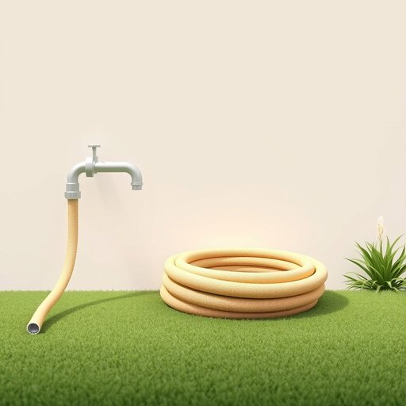

# hose

<h1 style="font-size: 2.5em; font-weight: 300; letter-spacing: 2px; margin: 0; color: #2c3e50;">
/hoʊz/
</h1>

---

---

## 例句

Before you start watering the garden, make sure the hose, which has been neatly coiled by the shed and attached to the outdoor tap, isn’t kinked or leaking, otherwise it won’t deliver enough pressure to reach the far end of the flower beds.

*Before(/ˌbiˈfɔr/) you(/ju/) start(/stɑrt/) watering(/ˈwɔtərɪŋ/) the(/ðə/) garden,(/ˈgɑrdən,/) make(/meɪk/) sure(/ʃʊr/) the(/ðə/) hose,(/hoʊz,/) which(/wɪʧ/) has(/həz/) been(/bɪn/) neatly(/ˈnitli/) coiled(/kɔɪld/) by(/baɪ/) the(/ðə/) shed(/ʃɛd/) and(/ənd/) attached(/əˈtæʧt/) to(/tɪ/) the(/ðə/) outdoor(/ˈaʊtˌdɔr/) tap,(/tæp,/) isn’t(/isn’t*/) kinked(/kinked*/) or(/ər/) leaking,(/ˈlikɪŋ,/) otherwise(/ˈəðərˌwaɪz/) it(/ɪt/) won’t(/won’t*/) deliver(/dɪˈlɪvər/) enough(/ɪˈnəf/) pressure(/ˈprɛʃər/) to(/tɪ/) reach(/riʧ/) the(/ðə/) far(/fɑr/) end(/ɛnd/) of(/əv/) the(/ðə/) flower(/flaʊər/) beds.(/bɛdz./)*

**翻译：** 在开始给花园浇水之前，请确保放在棚屋旁、已整齐盘好的水管没有扭结或漏水，否则水压不足，无法浇到花坛的远端。

---

## 解释

英语单词“hose”作为名词在家居生活用品场景中，通常指用来输送水或其他液体的软管，多见于花园浇水、清洁工作或家庭维修中，如garden hose（花园水管）。使用时，hose一般用单数或复数形式hose/hoses，复数形式发音为/həʊzɪz/。英语学习者需注意该词作为名词时不会以“s”结尾表示复数的口语习惯，而书面表达“hoses”为复数。此外，“hose”在不同固定搭配中意义明确，例如“rubber hose”（橡胶管）、“fire hose”（消防水带），这些搭配有助于理解其专业用法。该词源于古英语“hosa”，表示长袜或紧身裤，后来引申为管状物，反映了形状上的类似。中文中，“hose”在家居生活用品语境下准确译为“软管”或“水管”，强调其柔软、可弯曲的特性，避免与刚硬的“管子”混淆。需要指出的是，“hose”在非正式英语中也有与丝袜相关的含义，但在家居用品语境中无褒贬色彩，仅为中性名词，使用时应根据语境判断，避免误用。

---

<small style="color: #999; font-size: 0.9em;">2025-07-17 06:22:40</small>

