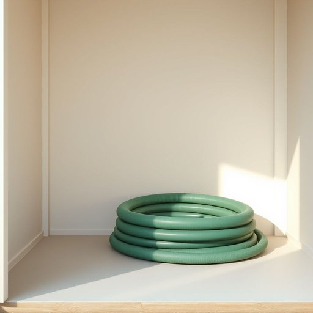

# hosepipe

<h1 style="font-size: 2.5em; font-weight: 300; letter-spacing: 2px; margin: 0; color: #2c3e50;">
/hosepipe*/
</h1>

---

---

## 例句

Before the forecasted heavy rain arrives this evening, could you please coil up the garden hosepipe neatly in the shed, ensuring that it isn’t kinked or tangled, so that it remains in good condition and ready for watering the flower beds during next week’s dry spell?

*Before(/ˌbiˈfɔr/) the(/ðə/) forecasted(/ˈfɔrˌkæstɪd/) heavy(/ˈhɛvi/) rain(/reɪn/) arrives(/əraɪvz/) this(/ðɪs/) evening,(/ˈivnɪŋ,/) could(/kʊd/) you(/ju/) please(/pliz/) coil(/kɔɪl/) up(/əp/) the(/ðə/) garden(/ˈgɑrdən/) hosepipe(/hosepipe*/) neatly(/ˈnitli/) in(/ɪn/) the(/ðə/) shed,(/ʃɛd,/) ensuring(/ɪnˈʃʊrɪŋ/) that(/ðət/) it(/ɪt/) isn’t(/isn’t*/) kinked(/kinked*/) or(/ər/) tangled,(/ˈtæŋgəld,/) so(/soʊ/) that(/ðət/) it(/ɪt/) remains(/rɪˈmeɪnz/) in(/ɪn/) good(/gʊd/) condition(/kənˈdɪʃən/) and(/ənd/) ready(/ˈrɛdi/) for(/fər/) watering(/ˈwɔtərɪŋ/) the(/ðə/) flower(/flaʊər/) beds(/bɛdz/) during(/ˈdʊrɪŋ/) next(/nɛkst/) week’s(/week’s*/) dry(/draɪ/) spell?(/spɛl?/)*

**翻译：** 在今晚预报的暴雨来临之前，能否请您将花园的水管整齐地盘放在储物棚内，确保水管不打结或缠绕，以保持良好状态，以备下周干旱时浇灌花坛之用？

---

## 解释

英语单词“hosepipe”作为名词，主要指家居生活中用于浇水、清洗或输送水流的橡胶软管，常见于花园、农场或消防场合，通常是一种柔软且可弯曲的管状工具，方便连接水龙头实现水的输送。在具体使用场合上，人们常用“hosepipe”来指代用于浇灌花草、清洗车辆或地面等活动时的水管。学习者在使用“hosepipe”时需注意它是可数名词，通常与量词连用如“一根hosepipe”，复数形式为“hosepipes”；此外，它常与动词“turn on”（开水）、“connect”（连接）等搭配，如“turn on the hosepipe”表示开水管。在表达技巧上，英国英语中“hosepipe ban”是一个常见搭配，指因干旱而临时禁止使用水管浇水的规定。词源方面，“hosepipe”由“hose”（最初指紧身裤，后来引申为软管）和“pipe”（管子）复合而成，体现了软且管状物的特征，起源于中世纪英语中的“hose”一词，再结合管材“pipe”描述水管特性。在中文语境中，“hosepipe”准确翻译为“软管”或“水管”，强调其作为家用浇水或输水工具的功能，区别于硬质金属管或塑料硬管；在日常生活中多称作“花园水管”或“橡胶水管”，便于理解和使用。该词本身无褒贬色彩，属于中性词汇，主要指实物，无特殊文化内涵，但在特定环境下，如“hosepipe ban”则反映英国特有的气候管理政策和节水文化背景。

---

<small style="color: #999; font-size: 0.9em;">2025-07-17 06:22:40</small>

