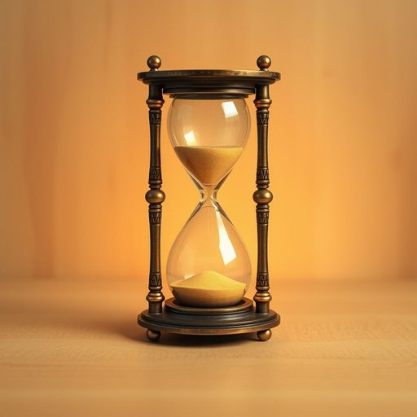

# hourglass

<h1 style="font-size: 2.5em; font-weight: 300; letter-spacing: 2px; margin: 0; color: #2c3e50;">
/ˈaʊərˌglæs/
</h1>

---

---

## 例句

While tidying up the living room, I stumbled upon the antique hourglass that my grandmother gifted us, which, despite its delicate glass and intricate brass frame, still reliably measures the passing of three minutes, making it not only a charming decorative piece but also surprisingly practical for timing tasks like steeping tea or managing short breaks during work-from-home days.

*While(/waɪl/) tidying(/tidying*/) up(/əp/) the(/ðə/) living(/ˈlɪvɪŋ/) room,(/rum,/) I(/aɪ/) stumbled(/ˈstəmbəld/) upon(/əˈpɑn/) the(/ðə/) antique(/ænˈtik/) hourglass(/ˈaʊərˌglæs/) that(/ðət/) my(/maɪ/) grandmother(/ˈgrændˌməðər/) gifted(/ˈgɪftɪd/) us,(/ˈjuˈɛs,/) which,(/wɪʧ,/) despite(/dɪˈspaɪt/) its(/ɪts/) delicate(/ˈdɛləkət/) glass(/glæs/) and(/ənd/) intricate(/ˈɪntrəkət/) brass(/bræs/) frame,(/freɪm,/) still(/stɪl/) reliably(/rɪˈlaɪəbli/) measures(/ˈmɛʒərz/) the(/ðə/) passing(/ˈpæsɪŋ/) of(/əv/) three(/θri/) minutes,(/ˈmɪnəts,/) making(/ˈmeɪkɪŋ/) it(/ɪt/) not(/nɑt/) only(/ˈoʊnli/) a(/ə/) charming(/ˈʧɑrmɪŋ/) decorative(/ˈdɛkrətɪv/) piece(/pis/) but(/bət/) also(/ˈɔlsoʊ/) surprisingly(/səˈpraɪzɪŋli/) practical(/ˈpræktɪkəl/) for(/fər/) timing(/ˈtaɪmɪŋ/) tasks(/tæsks/) like(/laɪk/) steeping(/steeping*/) tea(/ti/) or(/ər/) managing(/ˈmænəʤɪŋ/) short(/ʃɔrt/) breaks(/breɪks/) during(/ˈdʊrɪŋ/) work-from-home(/work-from-home*/) days.(/deɪz./)*

**翻译：** 整理客厅时，我偶然发现了祖母赠予我们的那只古董沙漏。尽管它由娇嫩的玻璃和精致的黄铜框架构成，但依然能可靠地计时三分钟，使其不仅成为一件别致的装饰品，更在泡茶或安排居家办公期间的短暂休息时，出人意料地实用。

---

## 解释

英语单词“hourglass”作为名词，在家居生活用品场景中通常指一种用来计时的沙漏，即由两个玻璃球状容器连接，中间细狭口允许沙子缓慢从上半部分流向下半部分，从而测量固定时间段的计时器。这种物品常见于厨房计时、桌面装饰或作为视觉提醒工具，适用于需要短时段计时的场合。英语学习者使用“hourglass”时应注意它是可数名词，复数形式为“hourglasses”，常见搭配包括“hourglass timer”（沙漏计时器）、“an hourglass figure”（形容曲线优美的体形，虽属比喻用法，但源自沙漏形状）等，且多用作具体物品的指代。该词来源于中古英语，组合自“hour”（小时）和“glass”（玻璃），反映了早期计时装置使用玻璃容器计时的特征。在中文语境中，“hourglass”准确翻译为“沙漏”，不仅指具体的计时器具，还象征时间的流逝，具有一定的文化象征意义。该词本身无褒贬色彩，但使用时应注意语境，有时作为比喻可表达时间紧迫或生命有限等深层含义。

---

<small style="color: #999; font-size: 0.9em;">2025-07-17 06:22:40</small>

