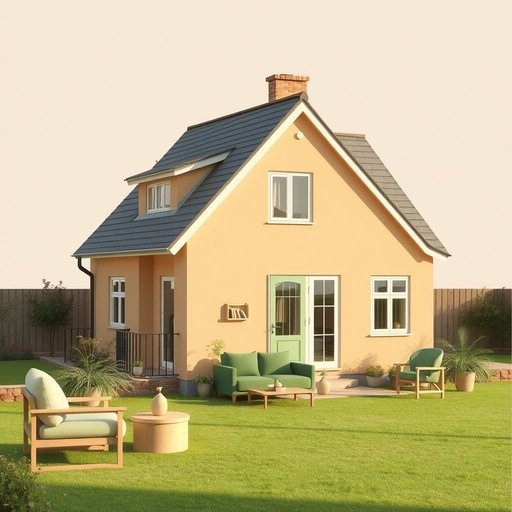

# house

<h1 style="font-size: 2.5em; font-weight: 300; letter-spacing: 2px; margin: 0; color: #2c3e50;">
/haʊs/
</h1>

---

---

## 例句

After we finally moved into the new house, which, despite its charming façade and spacious garden, required extensive repairs to the plumbing and electrical systems before we could fully settle in, we spent the weekend unpacking boxes, arranging furniture, and planning where to place all the household items to create a comfortable and functional living space.

*After(/ˈæftər/) we(/wi/) finally(/ˈfaɪnəli/) moved(/muvd/) into(/ˈɪntu/) the(/ðə/) new(/nu/) house,(/haʊs,/) which,(/wɪʧ,/) despite(/dɪˈspaɪt/) its(/ɪts/) charming(/ˈʧɑrmɪŋ/) façade(/façade*/) and(/ənd/) spacious(/ˈspeɪʃəs/) garden,(/ˈgɑrdən,/) required(/rikˈwaɪərd/) extensive(/ɪkˈstɛnsɪv/) repairs(/rɪˈpɛrz/) to(/tɪ/) the(/ðə/) plumbing(/ˈpləmɪŋ/) and(/ənd/) electrical(/ɪˈlɛktrɪkəl/) systems(/ˈsɪstəmz/) before(/ˌbiˈfɔr/) we(/wi/) could(/kʊd/) fully(/ˈfʊli/) settle(/ˈsɛtəl/) in,(/ɪn,/) we(/wi/) spent(/spɛnt/) the(/ðə/) weekend(/ˈwiˌkɪnd/) unpacking(/ənˈpækɪŋ/) boxes,(/ˈbɑksɪz,/) arranging(/ərˈeɪnʤɪŋ/) furniture,(/ˈfərnɪʧər,/) and(/ənd/) planning(/ˈplænɪŋ/) where(/wɛr/) to(/tɪ/) place(/pleɪs/) all(/ɔl/) the(/ðə/) household(/ˈhaʊsˌhoʊld/) items(/ˈaɪtəmz/) to(/tɪ/) create(/kriˈeɪt/) a(/ə/) comfortable(/ˈkəmfərtəbəl/) and(/ənd/) functional(/ˈfəŋkʃənəl/) living(/ˈlɪvɪŋ/) space.(/speɪs./)*

**翻译：** 在我们终于搬进新房子后，尽管它外观迷人且花园宽敞，但为了完全安顿，我们不得不对管道和电气系统进行了大规模修理。整个周末，我们忙于拆箱、摆放家具，并规划各类家居用品的位置，营造一个既舒适又实用的生活空间。

---

## 解释

英语单词“house”作为名词，主要指供人居住的建筑物，即“房子”或“住宅”，在家居生活用品的语境中使用尤为频繁，通常指独立的居住空间，区别于公寓、公寓楼或其他类型的居所。在具体使用场合上，“house”可以指单一家庭的住所，如“My house is near the park”中表示实际的居住房屋，亦可用来泛指某种风格或结构的住宅。此外，“house”还广泛出现在固定搭配中，如“household”（家庭，家务），跟家具、家用电器等居家物品相关，或“guest house”（招待所）、“housewarming”（乔迁）等表达，这些常见用法是英语学习者需要掌握的。语法上，“house”为可数名词，复数形式为“houses”，使用时应根据上下文明确单复数，特别注意不可与抽象意义混淆；此外，“house”在句中多作主语、宾语或表语，搭配动词时可用“build a house”、“buy a house”、“move into a house”等固定短语。学习时还需注意其作为动词的用法（如“to house”意为“为……提供住所”），与名词的区别。词源方面，“house”源自古英语“hūs”，与德语“Haus”、荷兰语“Huis”等同源，原意即为遮蔽物、居所，反映了居住的基本人类需求，这种历史背景帮助理解其稳定且基本的语义核心。在中文语境中，“house”准确翻译为“房子”或“住宅”，指具体的住所在空间和功能上的概念，避免误用为含义更广泛的“家”（home），“house”偏向强调物理建筑结构，而非“家”的情感归属和生活氛围，因此在中英转换时须根据语境做区分。该词通常无明显褒贬色彩，但在某些文化语境中，“house”若用于豪宅或名门府邸，则隐含身份和地位象征，英语中也有“household name”（家喻户晓的名字）等引申用法。整体来看，“house”作为家居生活用品相关词汇，是英语表达中基础且重要的名词，学习者应结合具体语境和搭配准确理解和应用。

---

<small style="color: #999; font-size: 0.9em;">2025-07-17 06:22:40</small>

