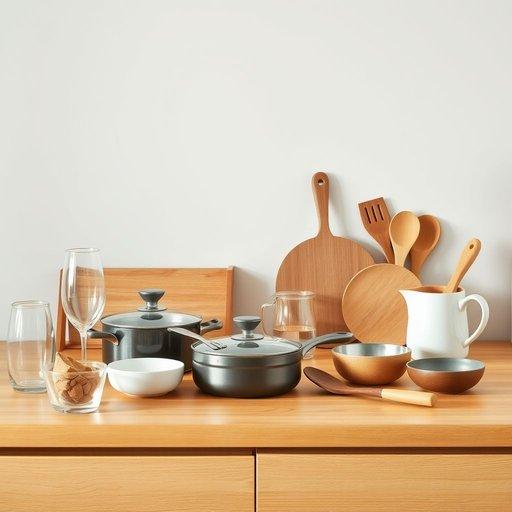

# houseware

<h1 style="font-size: 2.5em; font-weight: 300; letter-spacing: 2px; margin: 0; color: #2c3e50;">
/ˈhaʊsˌwɛr/
</h1>

---

---

## 例句

When we moved into the new flat, I spent the entire weekend unpacking all the houseware, including the delicate glassware, sturdy cookware, and assorted utensils, which had been carefully packed in several boxes, making sure each item was placed exactly where it would be most useful.

*When(/wɪn/) we(/wi/) moved(/muvd/) into(/ˈɪntu/) the(/ðə/) new(/nu/) flat,(/flæt,/) I(/aɪ/) spent(/spɛnt/) the(/ðə/) entire(/ɪnˈtaɪər/) weekend(/ˈwiˌkɪnd/) unpacking(/ənˈpækɪŋ/) all(/ɔl/) the(/ðə/) houseware,(/ˈhaʊsˌwɛr,/) including(/ˌɪnˈkludɪŋ/) the(/ðə/) delicate(/ˈdɛləkət/) glassware,(/ˈglæsˌwɛr,/) sturdy(/ˈstərdi/) cookware,(/ˈkʊkˌwɛr,/) and(/ənd/) assorted(/əˈsɔrtɪd/) utensils,(/juˈtɛnsəlz,/) which(/wɪʧ/) had(/hæd/) been(/bɪn/) carefully(/ˈkɛrfəli/) packed(/pækt/) in(/ɪn/) several(/ˈsɛvərəl/) boxes,(/ˈbɑksɪz,/) making(/ˈmeɪkɪŋ/) sure(/ʃʊr/) each(/iʧ/) item(/ˈaɪtəm/) was(/wɑz/) placed(/pleɪst/) exactly(/ɪgˈzæktli/) where(/wɛr/) it(/ɪt/) would(/wʊd/) be(/bi/) most(/moʊst/) useful.(/ˈjusfəl./)*

**翻译：** 搬进新公寓后，我用了整个周末时间拆包所有生活用品，包括精致的玻璃器皿、坚固的炊具和各式各样的餐具，这些物品都被小心地分装在几个箱子里，我确保每一件都被放置在最实用的位置。

---

## 解释

英语单词“houseware”作为名词，指的是日常家庭生活中使用的各种家居用品，尤其包括厨房用具、餐具、烹饪器具、清洁工具等非家具类的实用物品。具体使用场合通常涉及购物、家居布置或零售业，如超市、家居用品店、在线商店中介绍和分类相关商品时会使用该词。英语学习者在使用“houseware”时应注意它一般作不可数名词，表示一类物品的集合，不用于复数形式，因此常见搭配为“houseware products”或“houseware items”，而不是“housewares”。此外，常与“kitchen houseware”、“ceramic houseware”等词组搭配描述具体种类。词源方面，“houseware”由“house”（房屋、家庭）与“ware”（器具、制品）组合而成，后者源自古英语“waru”，意指商品或物品，合起来即表示家用器具。中文语境中，“houseware”准确翻译为“家居用品”或“家用器皿”，强调的是日常家庭使用的实用性器具，区别于家具（furniture）或装修材料。该词本身无明显褒贬色彩，属于中性词汇，常用于商业和生活场景中描述具体物品类别，文化内涵较为浅显，无特殊语言色彩。

---

<small style="color: #999; font-size: 0.9em;">2025-07-17 06:22:40</small>

