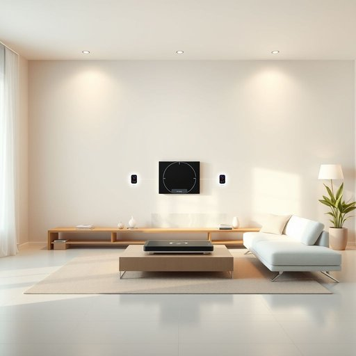

# hub

<h1 style="font-size: 2.5em; font-weight: 300; letter-spacing: 2px; margin: 0; color: #2c3e50;">
/həb/
</h1>

---

---

## 例句

The innovative hub, serving as the heart of the home automation system, seamlessly integrates various smart devices while optimizing energy consumption and enhancing user convenience, which ultimately transforms the entire living environment into a futuristic and efficient space.

*The(/ðə/) innovative(/ˈɪnəˌveɪtɪv/) hub,(/həb,/) serving(/ˈsərvɪŋ/) as(/ɛz/) the(/ðə/) heart(/hɑrt/) of(/əv/) the(/ðə/) home(/hoʊm/) automation(/ɔtəˈmeɪʃən/) system,(/ˈsɪstəm,/) seamlessly(/ˈsimləsli/) integrates(/ˈɪnəˌgreɪts/) various(/ˈvɛriəs/) smart(/smɑrt/) devices(/dɪˈvaɪsɪz/) while(/waɪl/) optimizing(/optimizing*/) energy(/ˈɛnərʤi/) consumption(/kənˈsəmʃən/) and(/ənd/) enhancing(/ɛnˈhænsɪŋ/) user(/ˈjuzər/) convenience,(/kənˈvinjəns,/) which(/wɪʧ/) ultimately(/ˈəltəmətli/) transforms(/trænsˈfɔrmz/) the(/ðə/) entire(/ɪnˈtaɪər/) living(/ˈlɪvɪŋ/) environment(/ɪnˈvaɪrənmənt/) into(/ˈɪntu/) a(/ə/) futuristic(/fˌjuʧərˈɪstɪk/) and(/ənd/) efficient(/ɪˈfɪʃənt/) space.(/speɪs./)*

**翻译：** 这一创新中枢作为智能家居系统的核心，完美整合各类智能设备，同时优化能源消耗，提升用户便利性，最终将整个居住环境转变为未来感十足且高效的空间。

---

## 解释

在家居生活用品的语境中，英语单词“hub”作为名词，通常指连接多个设备的中心装置，比如USB集线器（USB hub）、网络集线器（network hub）或智能家居控制中心（smart home hub），它的主要功能是作为信息、信号或电源的汇集点，实现设备间的连接与交互。英语学习者在使用“hub”时应注意其不可数名词属性常用于指设备或装置的整体，常见搭配有“USB hub”“wireless hub”“smart home hub”等，表达时通常强调其中心枢纽功能，句子中多作主语或宾语，例如“The USB hub connects multiple devices to one port.”此外，注意hub作为物理连接中心，不宜与抽象的“中心”混淆。词源上，hub来自古英语“hubb”或荷兰语“hubbe”，最初指车轮的轮毂，即车轮中央连接辐条的部分，后来引申为中心点或枢纽位置，这种物理结构的中心属性延续到了现代电子设备中的用途。在中文语境中，“hub”通常翻译为“集线器”、“枢纽”、“中央控制器”等，强调其作为连接点或控制中心的功能，不含贬义，多用于技术和家电领域，表达一种核心连接与管理的作用，没有特殊文化色彩或褒贬含义，属于中性词汇。

---

<small style="color: #999; font-size: 0.9em;">2025-07-17 06:22:40</small>

