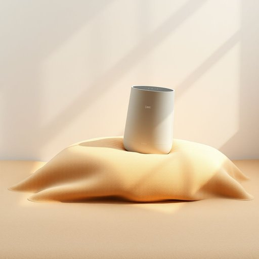

# humidifier

<h1 style="font-size: 2.5em; font-weight: 300; letter-spacing: 2px; margin: 0; color: #2c3e50;">
/hjuˈmɪdəˌfaɪər/
</h1>

---

---

## 例句

Since the central heating tends to dry out the air in the living room during winter, the humidity is affected significantly, which has led us to invest in a high-quality humidifier that not only maintains a comfortable humidity level but also prevents my skin from becoming excessively dry and reduces the chances of respiratory irritation.

*Since(/sɪns/) the(/ðə/) central(/ˈsɛntrəl/) heating(/ˈhitɪŋ/) tends(/tɛndz/) to(/tɪ/) dry(/draɪ/) out(/aʊt/) the(/ðə/) air(/ɛr/) in(/ɪn/) the(/ðə/) living(/ˈlɪvɪŋ/) room(/rum/) during(/ˈdʊrɪŋ/) winter,(/ˈwɪntər,/) the(/ðə/) humidity(/hjuˈmɪdəti/) is(/ɪz/) affected(/əˈfɛktɪd/) significantly,(/sɪgˈnɪfɪkəntli,/) which(/wɪʧ/) has(/həz/) led(/lɛd/) us(/ˈjuˈɛs/) to(/tɪ/) invest(/ˌɪnˈvɛst/) in(/ɪn/) a(/ə/) high-quality(/ˌhaɪkˈwɑləti/) humidifier(/hjuˈmɪdəˌfaɪər/) that(/ðət/) not(/nɑt/) only(/ˈoʊnli/) maintains(/meɪnˈteɪnz/) a(/ə/) comfortable(/ˈkəmfərtəbəl/) humidity(/hjuˈmɪdəti/) level(/ˈlɛvəl/) but(/bət/) also(/ˈɔlsoʊ/) prevents(/prɪˈvɛnts/) my(/maɪ/) skin(/skɪn/) from(/frəm/) becoming(/bɪˈkəmɪŋ/) excessively(/ɪkˈsɛsɪvli/) dry(/draɪ/) and(/ənd/) reduces(/rɪˈdusɪz/) the(/ðə/) chances(/ˈʧænsɪz/) of(/əv/) respiratory(/ˈrɛspərəˌtɔri/) irritation.(/ˌɪrɪˈteɪʃən./)*

**翻译：** 由于冬季中央供暖容易使客厅空气变得干燥，湿度受到显著影响，因此我们投资购买了一台高品质加湿器，它不仅能维持舒适的湿度水平，还能防止我的皮肤过于干燥，减少呼吸道刺激的可能性。

---

## 解释

单词"humidifier"作为名词，指的是一种家用或办公环境中常见的加湿器，主要功能是在空气干燥时增加空气湿度，改善环境舒适度，常见于冬季供暖或干燥气候地区。使用时多见于描述家居生活用品、室内空气调节设备等语境，如“turn on the humidifier to relieve dry skin”（开加湿器缓解皮肤干燥）。在语法上，humidifier为可数名词，使用时需注意冠词和数的搭配，如a humidifier、the humidifier或humidifiers，且常与动词“use”、“turn on/off”、“buy”等搭配。常见表达还包括“portable humidifier”（便携式加湿器）、“cool-mist humidifier”（冷雾加湿器）等。词源上，humidifier由形容词"humid"（潮湿的）加上后缀"-ifier"（表示“使动者”即使什么变成某状态的装置）组成，即“使空气湿润的装置”。在中文语境中，humidifier准确翻译为“加湿器”，这一词汇无褒贬色彩，属于中性词，主要是描述功能性家电设备。理解时应注意区分与除湿器（dehumidifier）的区别，前者增加湿度，后者减少湿度；且在表达时不可省略设备功能，避免误解。总体而言，humidifier是家居生活中常用且实用的空气调节设备名词，适用于日常英语交流和专业说明。

---

<small style="color: #999; font-size: 0.9em;">2025-07-17 06:22:40</small>

