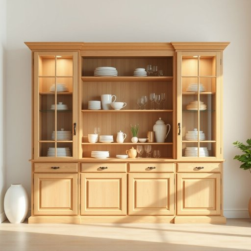

# hutch

<h1 style="font-size: 2.5em; font-weight: 300; letter-spacing: 2px; margin: 0; color: #2c3e50;">
/həʧ/
</h1>

---

---

## 例句

After the negotiation, the strategy involved multiple layers of analysis to ensure the agreement aligned with both parties' expectations and legal requirements.

*After(/ˈæftər/) the(/ðə/) negotiation,(/nɪˌgoʊʃiˈeɪʃən,/) the(/ðə/) strategy(/ˈstrætəʤi/) involved(/ˌɪnˈvɑlvd/) multiple(/ˈməltəpəl/) layers(/leɪərz/) of(/əv/) analysis(/æˈnælɪsɪs/) to(/tɪ/) ensure(/ɪnˈʃʊr/) the(/ðə/) agreement(/əˈgrimənt/) aligned(/əˈlaɪnd/) with(/wɪθ/) both(/boʊθ/) parties'(/ˈpɑrtiz'/) expectations(/ˌɛkspɛkˈteɪʃənz/) and(/ənd/) legal(/ˈligəl/) requirements.(/rɪkˈwaɪrmənts./)*

**翻译：** 谈判结束后，策略包括多层次的分析，以确保协议符合双方的期望和法律要求。

---

## 解释

英语单词"hutch"作为名词在家居生活用品语境中，通常指一种带有柜门或玻璃门、有隔层的储物柜，尤其是用来存放餐具、器皿或装饰品的橱柜，有时也特指带有笼子部分的兔笼或小型动物笼。具体使用场合多见于描述厨房、餐厅或起居室的家具，如“kitchen hutch”指厨房储物柜，或者描述宠物饲养设施时使用。英语学习者在使用"hutch"时需注意它通常作为可数名词使用，复数形式为"hutches"，且在表达时常搭配具体的形容词如“wooden hutch”（木制橱柜）或“rabbit hutch”（兔笼）。此外，"hutch"多用于具体名词搭配，表达技巧上可与“put something in the hutch”（把某物放入柜中）等短语结合使用。该词源自中古英语，起源于古法语“huchier”，意为存放物品的箱子，引申为带门的储物柜。中文环境中，"hutch"通常翻译为“带门小橱柜”、“碗柜”或根据具体用途译为“兔笼”等，需结合语境进行准确理解。在文化色彩上，"hutch"本身无明显褒贬色彩，属于中性用词，但在宠物相关语境中，现代环保和动物保护意识可能影响其使用者对“兔笼”等含义的感受和态度。

---

<small style="color: #999; font-size: 0.9em;">2025-07-17 06:22:40</small>

