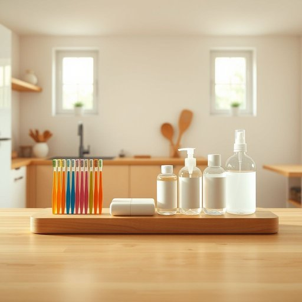

# hygiene

<h1 style="font-size: 2.5em; font-weight: 300; letter-spacing: 2px; margin: 0; color: #2c3e50;">
/ˈhaɪˌʤin/
</h1>

---

---

## 例句

Although we often overlook it, maintaining strict hygiene practices in communal areas such as the kitchen and bathroom is crucial because it not only prevents the spread of germs but also guarantees that everyone in the household feels secure and comfortable in their living environment.

*Although(/ˌɔlˈðoʊ/) we(/wi/) often(/ˈɔfən/) overlook(/ˈoʊvərˌlʊk/) it,(/ɪt,/) maintaining(/meɪnˈteɪnɪŋ/) strict(/strɪkt/) hygiene(/ˈhaɪˌʤin/) practices(/ˈpræktɪsɪz/) in(/ɪn/) communal(/kəmˈjunəl/) areas(/ˈɛriəz/) such(/səʧ/) as(/ɛz/) the(/ðə/) kitchen(/ˈkɪʧən/) and(/ənd/) bathroom(/ˈbæθˌrum/) is(/ɪz/) crucial(/ˈkruʃəl/) because(/bɪˈkəz/) it(/ɪt/) not(/nɑt/) only(/ˈoʊnli/) prevents(/prɪˈvɛnts/) the(/ðə/) spread(/sprɛd/) of(/əv/) germs(/ʤərmz/) but(/bət/) also(/ˈɔlsoʊ/) guarantees(/ˌgɛrənˈtiz/) that(/ðət/) everyone(/ˈɛvriˌwən/) in(/ɪn/) the(/ðə/) household(/ˈhaʊsˌhoʊld/) feels(/filz/) secure(/sɪˈkjʊr/) and(/ənd/) comfortable(/ˈkəmfərtəbəl/) in(/ɪn/) their(/ðɛr/) living(/ˈlɪvɪŋ/) environment.(/ɪnˈvaɪrənmənt./)*

**翻译：** 虽然我们常常忽视这一点，但在厨房和浴室等公共区域保持严格的卫生习惯至关重要，因为这不仅能有效防止细菌传播，还能确保每个家庭成员在居住环境中感到安全和舒适。

---

## 解释

英语单词"hygiene"作为名词，主要指的是保持身体或环境清洁以预防疾病的状态或习惯，在家居生活用品的语境中，通常涉及个人卫生用品如牙刷、肥皂、洗手液、消毒剂等，强调通过适当清洁和护理保障健康的行为或条件。使用时，hygiene多用于不可数名词形式，搭配常见表达有"personal hygiene"（个人卫生）、"oral hygiene"（口腔卫生）、"food hygiene"（食品卫生）等，语法上通常作为主语或宾语出现，需搭配适当的形容词或限定词，例如“good hygiene”（良好卫生）或“poor hygiene”（差卫生）。英语学习者应注意该词不可直接用复数形式，且在表达时多用整体概念而非具体物品。词源方面，"hygiene"源自希腊语“ὑγιεινή”（hugieinē），意为“健康的”，与希腊神话中的健康女神Hygieia有关，反映了健康和清洁的关联。中文语境下，"hygiene"准确译为“卫生”或“卫生习惯”，强调保障健康的清洁措施，与单纯的清洁不同，包含预防疾病的内涵，在描述家居用品时侧重于用品的功能性和防护健康的作用。该词通常中性，无特殊褒贬色彩，但在文化习惯中对卫生的重视程度不同，可能影响其具体使用频率和语境，整体上是健康、清洁的正面评价词汇。

---

<small style="color: #999; font-size: 0.9em;">2025-07-17 06:22:40</small>

