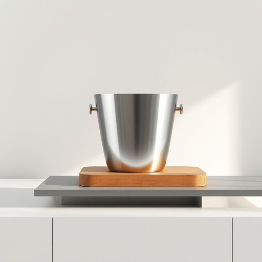

# ice-bucket

<h1 style="font-size: 2.5em; font-weight: 300; letter-spacing: 2px; margin: 0; color: #2c3e50;">
/ice-bucket*/
</h1>

---

---

## 例句

Could you please bring the silver ice-bucket from the sideboard, the one lined with stainless steel and insulated to keep the ice solid for hours, so that we can chill the champagne before our guests arrive this evening?

*Could(/kʊd/) you(/ju/) please(/pliz/) bring(/brɪŋ/) the(/ðə/) silver(/ˈsɪlvər/) ice-bucket(/ice-bucket*/) from(/frəm/) the(/ðə/) sideboard,(/sideboard*,/) the(/ðə/) one(/wən/) lined(/laɪnd/) with(/wɪθ/) stainless(/ˈsteɪnləs/) steel(/stil/) and(/ənd/) insulated(/ˈɪnsəˌleɪtɪd/) to(/tɪ/) keep(/kip/) the(/ðə/) ice(/aɪs/) solid(/ˈsɑləd/) for(/fər/) hours,(/aʊərz,/) so(/soʊ/) that(/ðət/) we(/wi/) can(/kən/) chill(/ʧɪl/) the(/ðə/) champagne(/ʃæmˈpeɪn/) before(/ˌbiˈfɔr/) our(/ɑr/) guests(/gɛsts/) arrive(/əraɪv/) this(/ðɪs/) evening?(/ˈivnɪŋ?/)*

**翻译：** 请您把边柜上那个内衬不锈钢、隔热保冷数小时的银质冰桶拿过来，好让我们在今晚客人到来前把香槟冰镇一下。

---

## 解释

ice-bucket作为名词，指的是一种用于盛放冰块的容器，常见于家居生活中的餐桌、厨房或聚会场合，主要功能是在饮用酒水或冷饮时保持冰块的冷冻状态，便于随时取用。英语学习者在使用该词时需注意它是复合名词，由ice和bucket组成，因此复数形式为ice-buckets，且一般搭配表达中常见用法有“an ice-bucket for chilling wine”（用于冷藏葡萄酒的冰桶）或“fill the ice-bucket with ice”（把冰桶装满冰块）。这一词汇源于ice（冰）和bucket（水桶）两个基本词汇组合，反映其作为容器装冰的功能，起源较为直白，主要因应冷饮和饮酒文化中对冰块储存的需求而形成。中文中通常将ice-bucket翻译为“冰桶”，该词准确传达了其用途和形状，无明显褒贬或文化色彩，属于中性实用性的家居生活用具词汇，有时在特定高档聚会环境中出现亦可体现一定的生活品质或礼仪象征。

---

<small style="color: #999; font-size: 0.9em;">2025-07-17 06:22:40</small>

