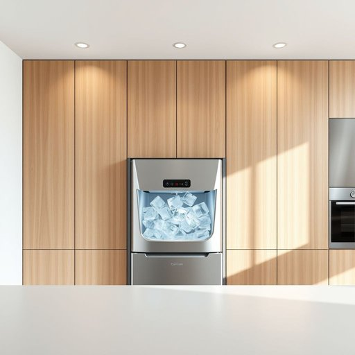

# ice-maker

<h1 style="font-size: 2.5em; font-weight: 300; letter-spacing: 2px; margin: 0; color: #2c3e50;">
/ice-maker*/
</h1>

---

---

## 例句

Although the new fridge came with a built-in ice-maker, which my partner was initially quite sceptical about because of past issues with similar appliances, we’ve found that its ability to produce crystal-clear cubes quickly and quietly has become indispensable, especially during family gatherings where keeping cocktails perfectly chilled is essential.

*Although(/ˌɔlˈðoʊ/) the(/ðə/) new(/nu/) fridge(/frɪʤ/) came(/keɪm/) with(/wɪθ/) a(/ə/) built-in(/ˈbɪlˌtɪn/) ice-maker,(/ice-maker*,/) which(/wɪʧ/) my(/maɪ/) partner(/ˈpɑrtnər/) was(/wɑz/) initially(/ˌɪˈnɪʃəli/) quite(/kwaɪt/) sceptical(/sceptical*/) about(/əˈbaʊt/) because(/bɪˈkəz/) of(/əv/) past(/pæst/) issues(/ˈɪʃuz/) with(/wɪθ/) similar(/ˈsɪmələr/) appliances,(/əˈplaɪənsɪz,/) we’ve(/we’ve*/) found(/faʊnd/) that(/ðət/) its(/ɪts/) ability(/əˈbɪləˌti/) to(/tɪ/) produce(/ˈproʊdus/) crystal-clear(/crystal-clear*/) cubes(/kjubz/) quickly(/kˈwɪkli/) and(/ənd/) quietly(/kˈwaɪətli/) has(/həz/) become(/bɪˈkəm/) indispensable,(/ˌɪndɪˈspɛnsəbəl,/) especially(/əˈspɛʃəli/) during(/ˈdʊrɪŋ/) family(/ˈfæməli/) gatherings(/ˈgæðərɪŋz/) where(/wɛr/) keeping(/ˈkipɪŋ/) cocktails(/ˈkɑkˌteɪlz/) perfectly(/ˈpərfəktli/) chilled(/ʧɪld/) is(/ɪz/) essential.(/ɛˈsɛnʃəl./)*

**翻译：** 虽然新冰箱配备了内置制冰机，我的伴侣起初对它持怀疑态度，因为过去使用过类似家电时遇到过问题，但我们发现它能快速且安静地制出晶莹剔透的冰块，已成为不可或缺的存在，尤其是在家庭聚会时保持鸡尾酒完美冰镇尤为重要。

---

## 解释

“ice-maker”作为名词，主要指一种家用或商用电器，用于自动制造冰块，常见于冰箱、饮料机或专门的制冰机中，适用于家庭厨房、餐厅、酒吧等场合，用以方便快速获取冰块，尤其在夏季或需要冷饮的环境中使用频繁。英语学习者在使用“ice-maker”时需注意，它是一个复合名词，通常写作单词间用连字符连接（ice-maker），表示“制冰机”或“制冰装置”，且在语法上属于具体物品名词，可作为主语、宾语使用。常见搭配包括“built-in ice-maker”（内置制冰机）、“portable ice-maker”（便携式制冰机）等，表达时可灵活使用定语修饰词。此外，注意复数形式为“ice-makers”，符合一般名词的复数规则。词源方面，“ice”指“冰”，来自古英语“īs”；“maker”意为“制造者”或“制造物”，源自动词“make”，两部分合成后直译为“制作冰的人或设备”。在中文语境中，“ice-maker”准确翻译为“制冰机”或“制冰装置”，强调其机械或电器功能，避免误译为“制冰者”或“冰制品制造者”，其含义纯中性，无特殊褒贬色彩，主要功能性描述，且在现代家居生活中普遍被理解为方便生活的家电设备，体现了科技带来的生活便利。

---

<small style="color: #999; font-size: 0.9em;">2025-07-17 06:22:40</small>

