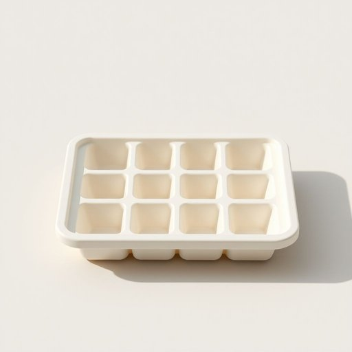

# ice-tray

<h1 style="font-size: 2.5em; font-weight: 300; letter-spacing: 2px; margin: 0; color: #2c3e50;">
/ice-tray*/
</h1>

---

---

## 例句

Although I misplaced my ice-tray this morning, I managed to find it just in time to fill it with water before the guests arrived, ensuring we had enough ice cubes to keep the beverages chilled throughout the party.

*Although(/ˌɔlˈðoʊ/) I(/aɪ/) misplaced(/mɪˈspleɪst/) my(/maɪ/) ice-tray(/ice-tray*/) this(/ðɪs/) morning,(/ˈmɔrnɪŋ,/) I(/aɪ/) managed(/ˈmænɪʤd/) to(/tɪ/) find(/faɪnd/) it(/ɪt/) just(/ʤɪst/) in(/ɪn/) time(/taɪm/) to(/tɪ/) fill(/fɪl/) it(/ɪt/) with(/wɪθ/) water(/ˈwɔtər/) before(/ˌbiˈfɔr/) the(/ðə/) guests(/gɛsts/) arrived,(/əraɪvd,/) ensuring(/ɪnˈʃʊrɪŋ/) we(/wi/) had(/hæd/) enough(/ɪˈnəf/) ice(/aɪs/) cubes(/kjubz/) to(/tɪ/) keep(/kip/) the(/ðə/) beverages(/ˈbɛvrɪʤɪz/) chilled(/ʧɪld/) throughout(/θruaʊt/) the(/ðə/) party.(/ˈpɑrti./)*

**翻译：** 虽然我今天早上把制冰盒放错了地方，但我及时找到了它，赶在客人到来之前装满了水，确保在整个聚会过程中有足够的冰块让饮品保持冰凉。

---

## 解释

“ice-tray”作为名词在家居生活用品语境中指的是一种用来制冰的小托盘，通常由塑料或金属制成，带有多个小格子，将水倒入其中后放入冰箱冷冻室以制作冰块。此词多用于家庭厨房场景，涉及日常饮食和饮料制作时，如制作冷饮、冰咖啡或冷却饮料等。英语学习者使用“ice-tray”时应注意它是由“ice”和“tray”两个名词复合而成的复合名词，通常作单数形式时保持原形，复数形式为“ice-trays”。作为名词，“ice-tray”不加冠词时通常指泛指，若特指某个具体托盘则需使用定冠词“the”或指示代词“this/that”；此外，“ice tray”有时也写作两个词，但两者意义相同。英语表达中常见搭配有“fill the ice-tray with water”（往制冰盘里倒水），“put the ice-tray in the freezer”（把制冰盘放进冰箱冷冻层）等。词源上“ice-tray”由19世纪以来英语中“ice”（冰）与“tray”（托盘、盘子）复合构成，体现该物品的本质功能，属于日常实用名词，无特殊文化或情感色彩。在中文语境中，“ice-tray”准确翻译为“制冰盘”或“制冰盒”，较日常且直观，涵盖了其功能与形态，适合家居生活相关话题使用。总的来说，此词为中性名词，描述的是一种常见厨房工具，不带褒贬含义，便于理解和记忆，是英语学习中常见的生活用品词汇。

---

<small style="color: #999; font-size: 0.9em;">2025-07-17 06:22:40</small>

