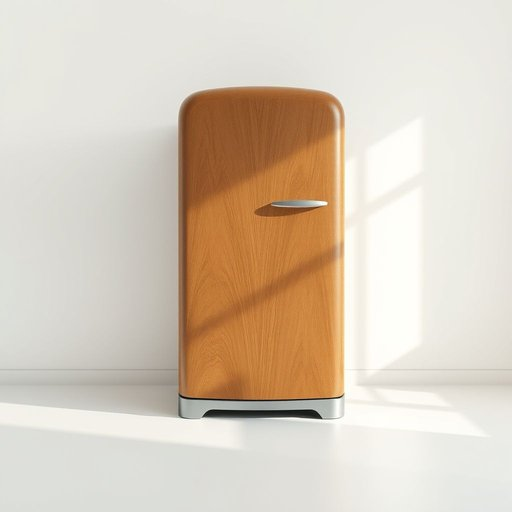

# icebox

<h1 style="font-size: 2.5em; font-weight: 300; letter-spacing: 2px; margin: 0; color: #2c3e50;">
/ˈaɪsˌbɑks/
</h1>

---

---

## 例句

Whenever the power went out during the storm last night, I rummaged through the icebox, which, despite its old-fashioned insulation and creaky hinges, managed to keep the leftovers fresh enough for breakfast, much to everyone's relief.

*Whenever(/wɛˈnɛvər/) the(/ðə/) power(/paʊər/) went(/wɛnt/) out(/aʊt/) during(/ˈdʊrɪŋ/) the(/ðə/) storm(/stɔrm/) last(/læst/) night,(/naɪt,/) I(/aɪ/) rummaged(/ˈrəmɪʤd/) through(/θru/) the(/ðə/) icebox,(/ˈaɪsˌbɑks,/) which,(/wɪʧ,/) despite(/dɪˈspaɪt/) its(/ɪts/) old-fashioned(/ˌoʊldˈfæʃənd/) insulation(/ˌɪnsəˈleɪʃən/) and(/ənd/) creaky(/ˈkriki/) hinges,(/ˈhɪnʤɪz,/) managed(/ˈmænɪʤd/) to(/tɪ/) keep(/kip/) the(/ðə/) leftovers(/ˈlɛfˌtoʊvərz/) fresh(/frɛʃ/) enough(/ɪˈnəf/) for(/fər/) breakfast,(/ˈbrɛkfəst,/) much(/məʧ/) to(/tɪ/) everyone's(/ˈɛvriˌwənz/) relief.(/rɪˈlif./)*

**翻译：** 昨晚暴风雨时，每当停电，我便翻找冰箱。尽管它的保温层老旧，铰链吱吱作响，但仍足以保持剩菜新鲜，让大家安心享用早餐。

---

## 解释

英语单词“icebox”作为名词，在家居生活用品的语境中指的是一种早期的冷藏设备，用于储存食物以保持新鲜。它通常是一种带有隔热层的木质或金属箱，内部放置冰块以降温，适用于电冰箱普及之前的家庭和餐饮场所。使用该词时，英语学习者应注意其主要为可数名词，常见搭配有“old-fashioned icebox”（老式冰箱）、“put food in the icebox”（把食物放进冰箱）等，语法上与其他具体家居名词相同，无复杂变形，复数形式为“iceboxes”。“icebox”一词源于19世纪末到20世纪初，当时尚未普及电冰箱，人们用放冰块的箱子来冷藏食物，因此词根由“ice”（冰）和“box”（箱子）组合而成，直译即“冰箱”。在中文语境中，通常译作“冰箱”或“冷藏箱”，但因现代中文“冰箱”一般指电冰箱，故需注意区分“icebox”指的是传统的非电制冷装置，含有一定的历史感和复古意味。该词本身无褒贬色彩，但在当代美语中多带有怀旧色彩，常见于描述早期生活状态或复古风格的语境中，文化内涵偏重于传统与历史背景的传递。

---

<small style="color: #999; font-size: 0.9em;">2025-07-17 06:22:40</small>

