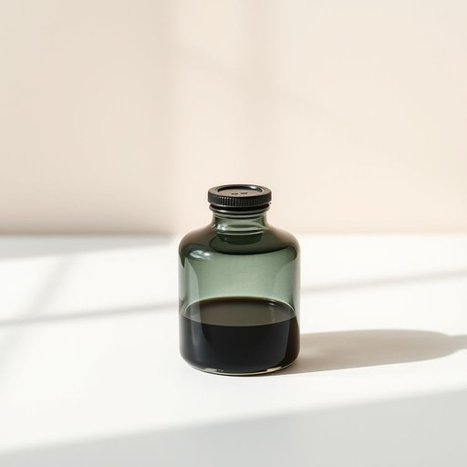

# ink

<h1 style="font-size: 2.5em; font-weight: 300; letter-spacing: 2px; margin: 0; color: #2c3e50;">
/ɪŋk/
</h1>

---

---

## 例句

Could you please check if there’s enough ink in the printer cartridge before I print those important documents, since the last time I tried, the pages came out blotchy and smudged, which made them look quite unprofessional?

*Could(/kʊd/) you(/ju/) please(/pliz/) check(/ʧɛk/) if(/ɪf/) there’s(/there’s*/) enough(/ɪˈnəf/) ink(/ɪŋk/) in(/ɪn/) the(/ðə/) printer(/ˈprɪnər/) cartridge(/ˈkɑrtrɪʤ/) before(/ˌbiˈfɔr/) I(/aɪ/) print(/prɪnt/) those(/ðoʊz/) important(/ˌɪmˈpɔrtənt/) documents,(/ˈdɑkjəmənts,/) since(/sɪns/) the(/ðə/) last(/læst/) time(/taɪm/) I(/aɪ/) tried,(/traɪd,/) the(/ðə/) pages(/ˈpeɪʤɪz/) came(/keɪm/) out(/aʊt/) blotchy(/ˈblɑtʧi/) and(/ənd/) smudged,(/sməʤd,/) which(/wɪʧ/) made(/meɪd/) them(/ðɛm/) look(/lʊk/) quite(/kwaɪt/) unprofessional?(/ˌənprəˈfɛʃənəl?/)*

**翻译：** 在我打印那些重要文件之前，能否请您先检查一下打印机墨盒里是否还有足够的墨水？上次我打印时，页面出现了斑驳和模糊，显得相当不专业。

---

## 解释

英语单词“ink”作为名词，在家居生活用品的语境中主要指的是用于书写、打印、绘画或复制等用途的液态颜料或染料，常见于墨水瓶、打印机墨盒、钢笔墨水等具体物品。使用时通常出现在描述文具、办公设备或艺术用品的场合，如“printer ink”（打印机墨水）、“bottle of ink”（墨水瓶）等。语法上，“ink”是不可数名词，一般不直接使用复数形式，表示具体种类或量时多用量词或词组搭配，比如“a drop of ink”（一滴墨水）、“some ink”（一些墨水）。常见搭配包括“ink cartridge”（墨盒）、“ink pad”（印泥）、“ink pen”（墨水笔）等。学习者需注意“ink”在动词形式时表示“给某物涂墨水”或“签署”，但在名词用法中专指墨水本体。词源方面，“ink”源自古英语“inc”或“enec”，追溯到拉丁语“encaustum”，意指用热制成的染料，反映了墨水最初用于绘画和书写的历史。中文语境中，“ink”准确翻译为“墨水”，通常指黑色或彩色液体，用于书写、打印或印章等，属于无褒贬色彩的中性词汇，广泛应用于学习、办公和艺术领域，无特殊文化内涵或情感色彩。

---

<small style="color: #999; font-size: 0.9em;">2025-07-17 06:22:40</small>

