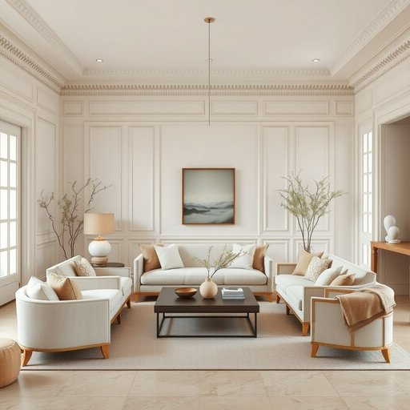

# interior

<h1 style="font-size: 2.5em; font-weight: 300; letter-spacing: 2px; margin: 0; color: #2c3e50;">
/ˌɪnˈtɪriər/
</h1>

---

---

## 例句

When we decided to renovate our living room, we focused not only on choosing exquisite furniture and cosy textiles but also on the interior, which, with its intricate mouldings and warm colour palette, truly reflects the traditional charm of a classic British home.

*When(/wɪn/) we(/wi/) decided(/ˌdɪˈsaɪdɪd/) to(/tɪ/) renovate(/ˈrɛnəˌveɪt/) our(/ɑr/) living(/ˈlɪvɪŋ/) room,(/rum,/) we(/wi/) focused(/ˈfoʊkɪst/) not(/nɑt/) only(/ˈoʊnli/) on(/ɔn/) choosing(/ˈʧuzɪŋ/) exquisite(/ˈɛkskwəzət/) furniture(/ˈfərnɪʧər/) and(/ənd/) cosy(/ˈkoʊzi/) textiles(/ˈtɛkˌstaɪlz/) but(/bət/) also(/ˈɔlsoʊ/) on(/ɔn/) the(/ðə/) interior,(/ˌɪnˈtɪriər,/) which,(/wɪʧ,/) with(/wɪθ/) its(/ɪts/) intricate(/ˈɪntrəkət/) mouldings(/ˈmoʊldɪŋz/) and(/ənd/) warm(/wɔrm/) colour(/ˈkələr/) palette,(/ˈpælət,/) truly(/ˈtruli/) reflects(/rɪˈflɛkts/) the(/ðə/) traditional(/trəˈdɪʃənəl/) charm(/ʧɑrm/) of(/əv/) a(/ə/) classic(/ˈklæsɪk/) British(/ˈbrɪtɪʃ/) home.(/hoʊm./)*

**翻译：** 当我们决定翻新客厅时，不仅着眼于挑选精致的家具和温馨的织物，更注重室内设计，其复杂的雕花和温暖的色调，真正展现了经典英国家庭的传统魅力。

---

## 解释

英语单词“interior”在家居生活用品场景中作为名词，主要指房屋、车辆或其他空间内部的部分，通常强调内部的空间布局、装饰和陈设等。使用时常见语境包括讨论家中房间布置、家具安排或房屋设计风格，如“the interior of the house”（房子的内部）或“car interior”（汽车内饰）。学习者需要注意，作为名词时“interior”是可数名词，常用单数形式来泛指某个空间的内部；且它常与介词“of”搭配使用，表示某物的内部部分，如“the interior of the building”。常见表达还有“interior design”（室内设计）、“interior decoration”（室内装潢）等。语法上，“interior”作为名词一般不用复数形式，但在描述不同类型或风格的内部时复数“interiors”也可出现。词源上，“interior”来自拉丁语“interior”，意为“在…之内的”，是“inter”（内部）+形容词后缀，原意指内里的、内部的。中文中“interior”准确翻译为“内部”、“内饰”或“室内”，具体含义根据语境而定。在家居领域，多指房屋内部空间及其布置，与“外部（exterior）”形成对比，常带有中性、描述性质，无褒贬色彩，但在设计领域提及“interior”时往往包含对空间美学和功能性的重视，体现一定的文化品味和生活品质追求。

---

<small style="color: #999; font-size: 0.9em;">2025-07-17 06:22:40</small>

