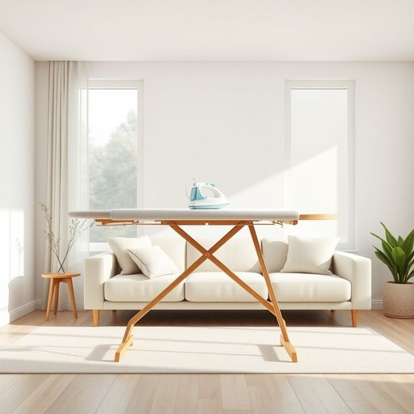

# iron-board

<h1 style="font-size: 2.5em; font-weight: 300; letter-spacing: 2px; margin: 0; color: #2c3e50;">
/iron-board*/
</h1>

---

---

## 例句

Before you start ironing your shirts, ensure that the ironing board, which we recently bought from the local department store because it has an adjustable height and a heat-resistant cover, is set up in the living room where there is plenty of natural light and enough space to move around comfortably.

*Before(/ˌbiˈfɔr/) you(/ju/) start(/stɑrt/) ironing(/ˈaɪərnɪŋ/) your(/jʊr/) shirts,(/ʃərts,/) ensure(/ɪnˈʃʊr/) that(/ðət/) the(/ðə/) ironing(/ˈaɪərnɪŋ/) board,(/bɔrd,/) which(/wɪʧ/) we(/wi/) recently(/ˈrisəntli/) bought(/bɔt/) from(/frəm/) the(/ðə/) local(/ˈloʊkəl/) department(/dɪˈpɑrtmənt/) store(/stɔr/) because(/bɪˈkəz/) it(/ɪt/) has(/həz/) an(/ən/) adjustable(/əˈʤəstəbəl/) height(/haɪt/) and(/ənd/) a(/ə/) heat-resistant(/heat-resistant*/) cover,(/ˈkəvər,/) is(/ɪz/) set(/sɛt/) up(/əp/) in(/ɪn/) the(/ðə/) living(/ˈlɪvɪŋ/) room(/rum/) where(/wɛr/) there(/ðɛr/) is(/ɪz/) plenty(/ˈplɛnti/) of(/əv/) natural(/ˈnæʧərəl/) light(/laɪt/) and(/ənd/) enough(/ɪˈnəf/) space(/speɪs/) to(/tɪ/) move(/muv/) around(/əraʊnd/) comfortably.(/ˈkəmfərtəbli./)*

**翻译：** 在开始熨烫衬衫之前，请确保我们最近从当地百货商店购买的熨衣板已在客厅安装好，该熨衣板具有可调节高度和耐热罩，且客厅光线充足，空间宽敞，便于舒适地活动。

---

## 解释

“iron-board”作为名词指的是家居生活中用于熨烫衣物的熨衣板，通常为长方形且具有可调节高度的平面，表面覆盖耐热材料，便于放置衣物进行熨烫。其具体使用场合一般是在家中洗衣和整理衣物时，配合熨斗使用，以消除衣物褶皱，保持衣物整洁平整。英语学习者在使用该词时应注意其复合词结构，通常“iron”作名词时表示“熨斗”，此处与“board”结合构成专有名词，复数形式为“iron-boards”，且前后两部分间通常用连字符连接以突出整体概念。常见搭配包括“set up an iron-board”（搭建熨衣板）、“fold the iron-board”（折叠熨衣板）等，表达时多与熨烫动作联系。此外，iron-board一词源自“iron”（熨斗）与“board”（板子）的组合，反映其作为操作平台的本质，起源可追溯至19世纪家庭生活中熨烫设备的普及。中文语境中，iron-board准确翻译为“熨衣板”或“熨板”，强调其辅助熨斗使用的实用工具性质，无特殊褒贬含义，也不带特殊文化色彩，主要体现家庭生活中的日常功能用品。

---

<small style="color: #999; font-size: 0.9em;">2025-07-17 06:22:40</small>

