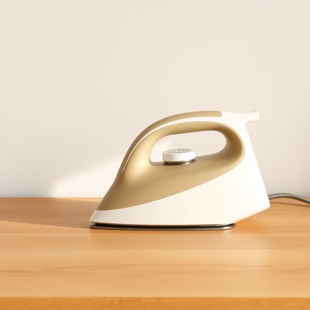

# iron

<h1 style="font-size: 2.5em; font-weight: 300; letter-spacing: 2px; margin: 0; color: #2c3e50;">
/aɪərn/
</h1>

---

---

## 例句

I left the iron plugged in on the kitchen counter, which worries me because not only could it be a fire hazard if forgotten overnight, but it also wastes electricity and adds to the bill, so please make sure to switch it off as soon as you're finished with the clothes.

*I(/aɪ/) left(/lɛft/) the(/ðə/) iron(/aɪərn/) plugged(/pləgd/) in(/ɪn/) on(/ɔn/) the(/ðə/) kitchen(/ˈkɪʧən/) counter,(/ˈkaʊntər,/) which(/wɪʧ/) worries(/ˈwəriz/) me(/mi/) because(/bɪˈkəz/) not(/nɑt/) only(/ˈoʊnli/) could(/kʊd/) it(/ɪt/) be(/bi/) a(/ə/) fire(/faɪər/) hazard(/ˈhæzərd/) if(/ɪf/) forgotten(/fərˈgɑtən/) overnight,(/ˈoʊvərˈnaɪt,/) but(/bət/) it(/ɪt/) also(/ˈɔlsoʊ/) wastes(/weɪsts/) electricity(/ɪˌlɛkˈtrɪsəti/) and(/ənd/) adds(/ædz/) to(/tɪ/) the(/ðə/) bill,(/bɪl,/) so(/soʊ/) please(/pliz/) make(/meɪk/) sure(/ʃʊr/) to(/tɪ/) switch(/swɪʧ/) it(/ɪt/) off(/ɔf/) as(/ɛz/) soon(/sun/) as(/ɛz/) you're(/jʊr/) finished(/ˈfɪnɪʃt/) with(/wɪθ/) the(/ðə/) clothes.(/kloʊðz./)*

**翻译：** 我把电熨斗落在了厨房台面上没拔电源，这让我很担心，因为如果整夜忘记关闭，不仅可能引发火灾隐患，还会浪费电力，增加电费支出，所以请务必在熨完衣服后立即关闭电源。

---

## 解释

英语单词“iron”在家居生活用品场景中作为名词，主要指“熨斗”，即用来通过加热压平衣物褶皱的电器或工具。具体使用场合通常是在描述熨烫衣物的动作、家务劳动或购买家用电器时，如“The iron is on the table”（熨斗放在桌子上）或“I need to buy a new iron”（我需要买一个新的熨斗）。英语学习者使用该词时需注意，其名词复数为“irons”，且不可与作为“铁”这一元素或金属时混淆，语境决定具体含义。常见搭配有“steam iron”（蒸汽熨斗）、“clothes iron”（衣物熨斗），以及与动词“iron”结合使用表示“熨烫”动作，如“iron clothes”。此外，应区分“iron”作为名词与动词的不同用法，避免混淆。词源方面，“iron”源自古英语“isern”或“iren”，原指铁这种金属，随后引申为用铁制成的熨斗工具，反映了早期熨斗多由铁制成的历史背景。在中文语境中，“iron”作为家居用品名词时应准确译为“熨斗”，而不是“铁”这种单纯的金属词义，否则容易产生理解偏差。该词在家居用品语境中无褒贬色彩，属于中性名词，文化内涵主要体现在家务劳动中的实用性和常见性。整体而言，理解其语境和搭配是准确掌握该词的关键。

---

<small style="color: #999; font-size: 0.9em;">2025-07-17 06:22:40</small>

