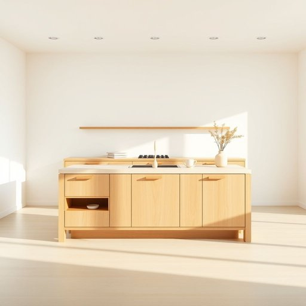

# island

<h1 style="font-size: 2.5em; font-weight: 300; letter-spacing: 2px; margin: 0; color: #2c3e50;">
/ˈaɪlənd/
</h1>

---

---

## 例句

Could you please clear off the kitchen island, which, despite its spacious surface and built-in storage compartments, has become cluttered with mail, half-empty mugs, and random utensils, making it difficult to prepare dinner efficiently?

*Could(/kʊd/) you(/ju/) please(/pliz/) clear(/klɪr/) off(/ɔf/) the(/ðə/) kitchen(/ˈkɪʧən/) island,(/ˈaɪlənd,/) which,(/wɪʧ,/) despite(/dɪˈspaɪt/) its(/ɪts/) spacious(/ˈspeɪʃəs/) surface(/ˈsərfəs/) and(/ənd/) built-in(/ˈbɪlˌtɪn/) storage(/ˈstɔrɪʤ/) compartments,(/kəmˈpɑrtmənts,/) has(/həz/) become(/bɪˈkəm/) cluttered(/ˈklətərd/) with(/wɪθ/) mail,(/meɪl,/) half-empty(/half-empty*/) mugs,(/məgz,/) and(/ənd/) random(/ˈrændəm/) utensils,(/juˈtɛnsəlz,/) making(/ˈmeɪkɪŋ/) it(/ɪt/) difficult(/ˈdɪfəkəlt/) to(/tɪ/) prepare(/priˈpɛr/) dinner(/ˈdɪnər/) efficiently?(/ɪˈfɪʃəntli?/)*

**翻译：** 请您清理一下厨房岛台，尽管它的台面宽敞且配有内置储物格，但如今却堆满了邮件、半空的杯子和零散的餐具，导致准备晚餐时变得不够高效。

---

## 解释

单词“island”在家居生活用品的英语语境中，通常指的是厨房中的“厨房岛”或“岛台”，即安装在厨房中央或空间较开阔处的独立工作台或储物台，既可作为操作台面，也可用作餐桌、储物柜等，具体使用场合多见于现代开放式厨房设计中。英语学习者在使用“island”时需注意其作为名词时通常用单数或复数形式islands，且在表示厨房岛时常与kitchen连用形成固定搭配“kitchen island”，此外还可与动词搭配如“install an island”，“build an island”或形容词如“modern island kitchen”搭配，这些表达帮助准确描述厨房空间布局和设计。在语法方面，“island”作为可数名词，前面需要冠词（如a/an/the）或数量词修饰。词源上，“island”来自古英语“ī(e)gland”，由“ī(e)g”（意为水域、岛屿）和“land”（土地）组成，原本指被水环绕的陆地，由此引申出现代厨具中的独立台面含义。中文语境中，应准确翻译为“岛屿”或在家居生活用品场景中翻译为“厨房岛”或“岛台”，强调其独立且功能多样的特点。需要注意的是，厨房岛作为家居布局的一部分，体现现代生活便利性和空间利用的理念，没有特殊的褒贬色彩，文化内涵主要体现现代家居设计趋势和开放式厨房文化。

---

<small style="color: #999; font-size: 0.9em;">2025-07-17 06:22:40</small>

