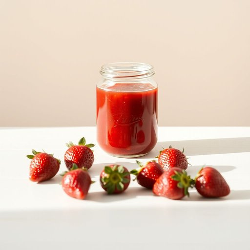

# jam

<h1 style="font-size: 2.5em; font-weight: 300; letter-spacing: 2px; margin: 0; color: #2c3e50;">
/ʤæm/
</h1>

---

---

## 例句

Could you please check if we still have any strawberry jam left in the pantry, as I need it not only for spreading on the toast this morning but also for the raspberry and jam tart I plan to bake later, which requires a generous amount of it to achieve the perfect balance of sweetness and texture?

*Could(/kʊd/) you(/ju/) please(/pliz/) check(/ʧɛk/) if(/ɪf/) we(/wi/) still(/stɪl/) have(/hæv/) any(/ˈɛni/) strawberry(/ˈstrɔˌbɛri/) jam(/ʤæm/) left(/lɛft/) in(/ɪn/) the(/ðə/) pantry,(/ˈpæntri,/) as(/ɛz/) I(/aɪ/) need(/nid/) it(/ɪt/) not(/nɑt/) only(/ˈoʊnli/) for(/fər/) spreading(/ˈsprɛdɪŋ/) on(/ɔn/) the(/ðə/) toast(/toʊst/) this(/ðɪs/) morning(/ˈmɔrnɪŋ/) but(/bət/) also(/ˈɔlsoʊ/) for(/fər/) the(/ðə/) raspberry(/ˈræzˌbɛri/) and(/ənd/) jam(/ʤæm/) tart(/tɑrt/) I(/aɪ/) plan(/plæn/) to(/tɪ/) bake(/beɪk/) later,(/ˈleɪtər,/) which(/wɪʧ/) requires(/rikˈwaɪərz/) a(/ə/) generous(/ˈʤɛnərəs/) amount(/əˈmaʊnt/) of(/əv/) it(/ɪt/) to(/tɪ/) achieve(/əˈʧiv/) the(/ðə/) perfect(/ˈpərˌfɪkt/) balance(/ˈbæləns/) of(/əv/) sweetness(/sˈwitnəs/) and(/ənd/) texture?(/ˈtɛksʧər?/)*

**翻译：** 请您帮忙查看一下我们储藏室里是否还有草莓酱，因为我今天早上不仅要涂抹在吐司上，还计划稍晚烤一款覆盆子果酱挞，那道甜点需要大量草莓酱，以达到完美的甜度与质感平衡。

---

## 解释

在家居生活用品场景中，英语单词“jam”作为名词主要指果酱，即用水果和糖经过煮制后制成的甜味涂抹品，常用于涂抹面包、烤饼等。具体使用时，多见于早餐、茶点或烘焙相关语境，例如“strawberry jam”（草莓果酱）、“jar of jam”（一罐果酱）。学习者需要注意的是，“jam”作为不可数名词时通常不加复数，也可搭配量词如“一罐果酱”。此外，果酱在英语表达中常与“spread”（涂抹物）搭配，如“jam and butter spread”。语法上，“jam”作为名词，多用作可数或不可数，根据具体语境而定，如指一罐果酱为可数，泛指果酱则不可数。词源方面，“jam”源自中古英语，最初指“挤压、塞满”，后来演变为果酱的含义，因制果酱时需将水果压碎或密封而得名。在中文语境中，“jam”准确翻译为“果酱”，强调其作为食品的甜味涂抹品，无褒贬色彩，属于中性词汇，具有明显的家庭使用和食品类别特征，文化上与西方早餐习惯紧密相关。总之，作为家居用品名词，“jam”指的是一种日常常见的食品原料，应结合语境把握其数量表达和搭配方式，避免与其在其他场景中如“交通堵塞”（traffic jam）等义混淆。

---

<small style="color: #999; font-size: 0.9em;">2025-07-17 06:22:40</small>

