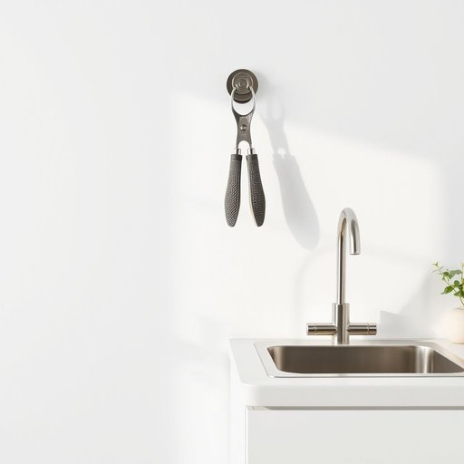

# jar-opener

<h1 style="font-size: 2.5em; font-weight: 300; letter-spacing: 2px; margin: 0; color: #2c3e50;">
/jar-opener*/
</h1>

---

---

## 例句

Could you please hand me the jar-opener hanging beside the sink, the one with the textured grip and rubber handle, since this stubborn jar of pickles refuses to budge despite all my efforts?

*Could(/kʊd/) you(/ju/) please(/pliz/) hand(/hænd/) me(/mi/) the(/ðə/) jar-opener(/jar-opener*/) hanging(/ˈhæŋɪŋ/) beside(/ˌbiˈsaɪd/) the(/ðə/) sink,(/sɪŋk,/) the(/ðə/) one(/wən/) with(/wɪθ/) the(/ðə/) textured(/ˈtɛksʧərd/) grip(/grɪp/) and(/ənd/) rubber(/ˈrəbər/) handle,(/ˈhændəl,/) since(/sɪns/) this(/ðɪs/) stubborn(/ˈstəbərn/) jar(/ʤɑr/) of(/əv/) pickles(/ˈpɪkəlz/) refuses(/rɪfˈjuzɪz/) to(/tɪ/) budge(/bəʤ/) despite(/dɪˈspaɪt/) all(/ɔl/) my(/maɪ/) efforts?(/ˈɛfərts?/)*

**翻译：** 能不能请你把挂在水槽旁边的开罐器递给我，就是那个带有防滑把手和橡胶握柄的，因为这只固执的泡菜罐，无论我怎么努力都打不开。

---

## 解释

“jar-opener”作为名词，指的是一种专门用来辅助开启罐子或瓶盖的工具，常见于厨房和家居生活用品的语境中，尤其当罐盖过紧难以用手拧开时使用。使用场合多为家庭做饭或储藏食物时，如打开果酱罐、腌菜罐等。英语学习者在使用该词时需注意其构成是复合名词，由“jar”（罐子）和“opener”（开启器）组成，通常作为单数或复数形式出现（jar-opener/jar-openers），一般置于句中作主语或宾语，后接动词或修饰词。常见搭配包括“use a jar-opener”，“buy a jar-opener”以及“a rubber jar-opener”等，描述具体类型时会加形容词。该词的词源源自日常动作“open a jar”（打开罐子），将动词短语转化为名词形式，反映实用功能工具的发展。中文语境中，准确翻译为“开瓶器”、“开罐器”或“罐头开瓶器”，强调其辅助开启的工具属性，无贬义或褒义色彩，属于中性实用词汇，体现现代厨房工具多样化与便利化的文化特点。

---

<small style="color: #999; font-size: 0.9em;">2025-07-17 06:22:40</small>

