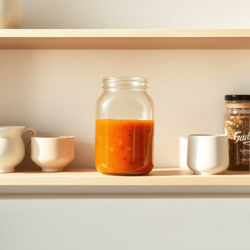

# jar

<h1 style="font-size: 2.5em; font-weight: 300; letter-spacing: 2px; margin: 0; color: #2c3e50;">
/ʤɑr/
</h1>

---

---

## 例句

Could you please pass me that jar of homemade chutney sitting on the top shelf next to the collection of mismatched mugs and the row of spice tins that have been gathering dust since we last did a thorough kitchen tidy-up?

*Could(/kʊd/) you(/ju/) please(/pliz/) pass(/pæs/) me(/mi/) that(/ðət/) jar(/ʤɑr/) of(/əv/) homemade(/ˈhoʊˈmeɪd/) chutney(/ˈʧətni/) sitting(/ˈsɪtɪŋ/) on(/ɔn/) the(/ðə/) top(/tɔp/) shelf(/ʃɛlf/) next(/nɛkst/) to(/tɪ/) the(/ðə/) collection(/kəˈlɛkʃən/) of(/əv/) mismatched(/mɪsˈmæʧt/) mugs(/məgz/) and(/ənd/) the(/ðə/) row(/roʊ/) of(/əv/) spice(/spaɪs/) tins(/tɪnz/) that(/ðət/) have(/hæv/) been(/bɪn/) gathering(/ˈgæðərɪŋ/) dust(/dəst/) since(/sɪns/) we(/wi/) last(/læst/) did(/dɪd/) a(/ə/) thorough(/θəroʊ/) kitchen(/ˈkɪʧən/) tidy-up?(/tidy-up*?/)*

**翻译：** 请你帮我递一下放在最上层货架上的那罐自制酸辣酱，就在一堆不配套的杯子旁边，还有那排自我们上次彻底整理厨房以来一直积着灰尘的香料罐旁边。

---

## 解释

英语单词“jar”作为名词在家居生活用品的语境中，通常指一种带盖的透明或半透明容器，多由玻璃或塑料制成，广泛用于储存食品如酱料、果酱、蜂蜜、调味品等。具体使用场合多出现在厨房、餐桌或储藏室中，如“一瓶蜂蜜”（a jar of honey），强调其容量适中且便于密封保存。英语学习者在使用“jar”时应注意其不可数与可数的区分，一般“jar”作为容器是可数名词，需搭配适当的冠词或数词，如“a jar”、“three jars”，而且常与介词“of”连用表示瓶中所装内容，如“a jar of pickles”。常见搭配包括“glass jar”（玻璃罐）、“jar lid”（罐盖）等。此外，值得注意的是“jar”作为动词时含义不同，指震动或冲击，避免混淆。词源上，“jar”一词源自中古英语，借自法语“jarre”，其根源可能来自古突厥语或其它欧亚语言，意指瓮或罐，有保存食物的传统文化背景。在中文语境中，“jar”准确翻译为“罐子”、“瓶子”或“罐”，根据具体用途不同也可译为“玻璃罐”或“密封罐”，通常不带负面色彩，属于中性词汇，无特殊褒贬或文化内涵，主要传递实用和储存功能的意象。整体来说，作为家居生活用品名词，使用“jar”时应结合具体内容表达，掌握其可数性和搭配结构，有助于提高语言表达的准确性和自然度。

---

<small style="color: #999; font-size: 0.9em;">2025-07-17 06:22:40</small>

