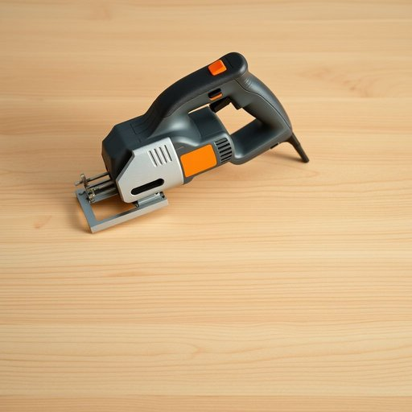

# jigsaw

<h1 style="font-size: 2.5em; font-weight: 300; letter-spacing: 2px; margin: 0; color: #2c3e50;">
/ˈʤɪgˌsɔ/
</h1>

---

---

## 例句

Despite the complexity of the legal documents, her astute analysis allowed her to identify the subtle clause that could potentially void the entire contract.

*Despite(/dɪˈspaɪt/) the(/ðə/) complexity(/kəmˈplɛksɪti/) of(/əv/) the(/ðə/) legal(/ˈligəl/) documents,(/ˈdɑkjəmənts,/) her(/hər/) astute(/əˈstut/) analysis(/æˈnælɪsɪs/) allowed(/əˈlaʊd/) her(/hər/) to(/tɪ/) identify(/aɪˈdɛntəˌfaɪ/) the(/ðə/) subtle(/ˈsətəl/) clause(/klɔz/) that(/ðət/) could(/kʊd/) potentially(/pəˈtɛnʃəli/) void(/vɔɪd/) the(/ðə/) entire(/ɪnˈtaɪər/) contract.(/ˈkɑnˌtrækt./)*

**翻译：** 尽管法律文件内容复杂，她敏锐的分析使她能够发现那条可能使整个合同无效的细微条款。

---

## 解释

“jigsaw”作为名词在家居生活用品的英语语境中，主要指一种电动工具，即“拼图锯”或“曲线锯”，用于切割木材、塑料或金属等材料，特别适合进行弯曲或复杂形状的切割。具体使用场合常见于家庭装修、木工制作或手工爱好者DIY过程中。当英语学习者使用该词时，需注意它通常用作可数名词，复数形式为“jigsaws”，且常与动词“use”连用，如“use a jigsaw to cut the wood”；此外，常见的搭配还有“electric jigsaw”（电动拼图锯）、“cordless jigsaw”（无绳拼图锯）或“jigsaw blade”（拼图锯片）。词源上，“jigsaw”起源于19世纪的拼图（jigsaw puzzles），后因工具切割形状的灵活多变，得名为拼图锯。其名称组合自“jig”（夹具）和“saw”（锯），强调该工具能沿曲线“拼接”切割。中文语境中，通常准确翻译为“拼图锯”或“曲线锯”，是家居装修和木工中常用的工具名称，无褒贬色彩，属于中性词汇。文化上，无特殊附加意义，仅代表实用工具，学习时应避免混淆其与拼图游戏等非工具性质的含义。

---

<small style="color: #999; font-size: 0.9em;">2025-07-17 06:22:40</small>

