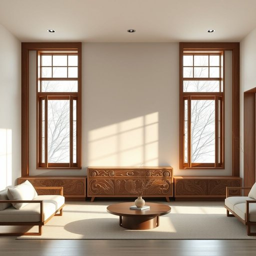

# joinery

<h1 style="font-size: 2.5em; font-weight: 300; letter-spacing: 2px; margin: 0; color: #2c3e50;">
/ˈʤɔɪnəri/
</h1>

---

---

## 例句

The bespoke craftsmanship required for the joinery, which encompassed intricately carved cupboards and seamlessly fitted window frames, not only enhanced the aesthetic appeal of the living room but also ensured an optimal balance between storage capacity and natural light.

*The(/ðə/) bespoke(/bespoke*/) craftsmanship(/ˈkræftsmənˌʃɪp/) required(/rikˈwaɪərd/) for(/fər/) the(/ðə/) joinery,(/ˈʤɔɪnəri,/) which(/wɪʧ/) encompassed(/ɛnˈkəmpəst/) intricately(/ˈɪntrəkətli/) carved(/kɑrvd/) cupboards(/ˈkəbərdz/) and(/ənd/) seamlessly(/ˈsimləsli/) fitted(/ˈfɪtɪd/) window(/ˈwɪndoʊ/) frames,(/freɪmz,/) not(/nɑt/) only(/ˈoʊnli/) enhanced(/ɛnˈhænst/) the(/ðə/) aesthetic(/ɛsˈθɛtɪk/) appeal(/əˈpil/) of(/əv/) the(/ðə/) living(/ˈlɪvɪŋ/) room(/rum/) but(/bət/) also(/ˈɔlsoʊ/) ensured(/ɪnˈʃʊrd/) an(/ən/) optimal(/ˈɑptɪməl/) balance(/ˈbæləns/) between(/bɪtˈwin/) storage(/ˈstɔrɪʤ/) capacity(/kəˈpæsɪti/) and(/ənd/) natural(/ˈnæʧərəl/) light.(/laɪt./)*

**翻译：** 定制工艺用于木工制作，包括精雕细琢的橱柜和无缝贴合的窗框，不仅提升了客厅的美观度，还确保了储物容量与自然采光之间的最佳平衡。

---

## 解释

英语单词“joinery”在家居生活用品语境中作为名词，主要指室内木工工艺，特别是制作和安装木制门窗、橱柜、家具的工艺或成品组件。具体使用场合多见于房屋装修、家具制造以及木工行业中，指的是木质构件的精细连接技术或相关制品，如门框、窗框、楼梯、橱柜门等。英语学习者在使用“joinery”时应注意它通常为不可数名词，表达整体的木工工艺或木制品范畴，但在某些复数形式“joineries”中可指不同类型或样式的木工制品。常见搭配有“joinery work”（木工活）、“wooden joinery”（木质木工制品）、“custom joinery”（定制木工制品）等，表达时多结合具体的房屋部件或制造工艺。词源方面，“joinery”源自“join”一词，意指连接，将“-ery”后缀用于构成名词，表示一个以连接木头为核心技艺的工艺或行业，体现了木工连接技术的专业性。在中文语境中，“joinery”准确译为“木工制品”或“木工工艺”，尤指室内使用的木质门窗、橱柜等构件，不单指木工动作，更强调其专业制作技术和成品。这个词本身没有褒贬含义，属于中性专业术语，但因涉及手工技艺，常含精细、工艺讲究的文化内涵，体现了传统木工技艺的重要性和精致化家居建材的价值。

---

<small style="color: #999; font-size: 0.9em;">2025-07-17 06:22:40</small>

