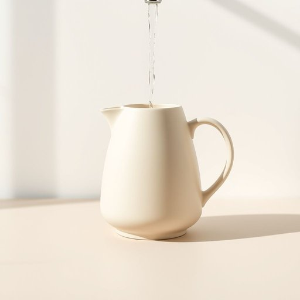

# jug

<h1 style="font-size: 2.5em; font-weight: 300; letter-spacing: 2px; margin: 0; color: #2c3e50;">
/ʤəg/
</h1>

---

---

## 例句

Could you please fill the jug with fresh water from the kitchen tap before we start preparing the meal, as it’s much easier to pour from the jug than directly from the bottle when setting the table with glasses and cutlery?

*Could(/kʊd/) you(/ju/) please(/pliz/) fill(/fɪl/) the(/ðə/) jug(/ʤəg/) with(/wɪθ/) fresh(/frɛʃ/) water(/ˈwɔtər/) from(/frəm/) the(/ðə/) kitchen(/ˈkɪʧən/) tap(/tæp/) before(/ˌbiˈfɔr/) we(/wi/) start(/stɑrt/) preparing(/pərˈpɛrɪŋ/) the(/ðə/) meal,(/mil,/) as(/ɛz/) it’s(/it’s*/) much(/məʧ/) easier(/ˈiziər/) to(/tɪ/) pour(/pɔr/) from(/frəm/) the(/ðə/) jug(/ʤəg/) than(/ðən/) directly(/dɪˈrɛkli/) from(/frəm/) the(/ðə/) bottle(/ˈbɑtəl/) when(/wɪn/) setting(/ˈsɛtɪŋ/) the(/ðə/) table(/ˈteɪbəl/) with(/wɪθ/) glasses(/ˈglæsɪz/) and(/ənd/) cutlery?(/ˈkətləri?/)*

**翻译：** 在我们开始准备餐点之前，您能否先用厨房水龙头的清水把水壶装满？因为在摆放杯子和餐具时，从水壶倒水比直接从瓶子倒水要方便得多。

---

## 解释

英语单词“jug”作为名词在家居生活用品语境中，通常指一种带有把手和口部的容器，用于盛装和倒液体，如水、牛奶、果汁等，常见于厨房或餐桌上。具体使用场合多为描述日常饮食或烹饪情境，例如“一壶水”或“奶壶”。英语学习者在使用“jug”时需要注意它通常是可数名词，复数形式为“jugs”，且常与量词或具体内容搭配，如“一壶茶”或“大陶壶”。此外，“jug”在某些英语口语中也可指监狱（俚语）或用于表示惩罚等，但在家居用品语境应避免混淆。词源方面，“jug”源自中古英语“jugge”，可能源自荷兰语或低地德语，历史上用来指代一种盛酒的陶壶，这反映了它作为盛液体容器的传统功能。在中文语境中，“jug”可准确翻译为“壶”或“水壶”，强调其带把手便于倒出的特征，区别于无把手的“瓶”或“罐”。该词本身无明显褒贬色彩，属于中性词汇，但在不同语境下可有隐含意义，需结合具体对话环境理解。总之，理解“jug”时应把握其容器属性、常见搭配及文化背景，从而准确运用于英语交流和中文翻译中。

---

<small style="color: #999; font-size: 0.9em;">2025-07-17 06:22:40</small>

