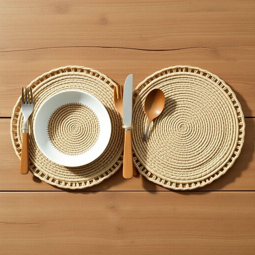

# jute

<h1 style="font-size: 2.5em; font-weight: 300; letter-spacing: 2px; margin: 0; color: #2c3e50;">
/ʤut/
</h1>

---

---

## 例句

I decided to replace the worn-out plastic placemats with beautifully woven jute ones, which not only add a rustic charm to the dining table but also prove to be more environmentally friendly and durable, especially when paired with the antique oak cutlery set we inherited from my grandmother.

*I(/aɪ/) decided(/ˌdɪˈsaɪdɪd/) to(/tɪ/) replace(/ˌriˈpleɪs/) the(/ðə/) worn-out(/worn-out*/) plastic(/ˈplæstɪk/) placemats(/placemats*/) with(/wɪθ/) beautifully(/ˈbjutəfli/) woven(/ˈwoʊvən/) jute(/ʤut/) ones,(/wənz,/) which(/wɪʧ/) not(/nɑt/) only(/ˈoʊnli/) add(/æd/) a(/ə/) rustic(/ˈrəstɪk/) charm(/ʧɑrm/) to(/tɪ/) the(/ðə/) dining(/ˈdaɪnɪŋ/) table(/ˈteɪbəl/) but(/bət/) also(/ˈɔlsoʊ/) prove(/pruv/) to(/tɪ/) be(/bi/) more(/mɔr/) environmentally(/ɪnˌvaɪrənˈmɛnəli/) friendly(/ˈfrɛndli/) and(/ənd/) durable,(/ˈdʊrəbəl,/) especially(/əˈspɛʃəli/) when(/wɪn/) paired(/pɛrd/) with(/wɪθ/) the(/ðə/) antique(/ænˈtik/) oak(/oʊk/) cutlery(/ˈkətləri/) set(/sɛt/) we(/wi/) inherited(/ˌɪnˈhɛrətɪd/) from(/frəm/) my(/maɪ/) grandmother.(/ˈgrændˌməðər./)*

**翻译：** 我决定用精美编织的黄麻餐垫替换那些破旧的塑料餐垫，这不仅为餐桌增添了一份乡村韵味，更显环保耐用，尤其是搭配我们从祖母那里继承的古董橡木餐具时，更添一份别致与情怀。

---

## 解释

英语单词“jute”作为名词在家居生活用品语境中通常指黄麻，这是一种天然纤维，广泛用于制作地毯、窗帘、布包、垫子等家居装饰和实用用品。具体使用场合多见于描述材料成分或强调环保、耐用特性的情境，如“a jute rug”（黄麻地毯）或“jute bags”（黄麻袋）。学习者需注意，jute在英语中通常作为不可数名词使用，因此不加复数形式，表达数量时多用“some jute”或“a piece of jute”等结构；此外，常见搭配有“jute fibers/fabric/carpets/bags”，用法相对固定。在词源方面，jute源自孟加拉地区的方言，经过英语吸收后泛指这种纤维植物，历史上该纤维因其经济、环保和耐磨特性而被广泛种植和使用。中文语境中，“jute”准确译为“黄麻”，强调其天然纤维属性，通常无褒贬色彩，更多体现的是一种乡土、环保及实用价值的认知，符合天然材料的正面文化内涵，适合在家居生活用品介绍中使用。

---

<small style="color: #999; font-size: 0.9em;">2025-07-17 06:22:40</small>

