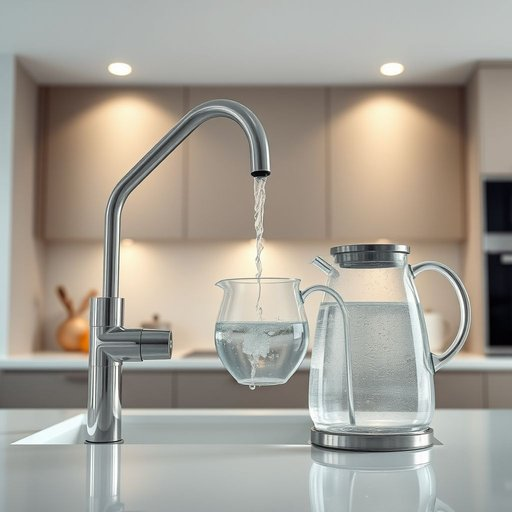

# kettle

<h1 style="font-size: 2.5em; font-weight: 300; letter-spacing: 2px; margin: 0; color: #2c3e50;">
/ˈkɛtəl/
</h1>

---

---

## 例句

Could you please check if the tap is functioning properly before filling the kettle with fresh water, so we can ensure a smooth process when preparing tea for the guests this afternoon?

*Could(/kʊd/) you(/ju/) please(/pliz/) check(/ʧɛk/) if(/ɪf/) the(/ðə/) tap(/tæp/) is(/ɪz/) functioning(/ˈfəŋkʃənɪŋ/) properly(/ˈprɑpərli/) before(/ˌbiˈfɔr/) filling(/ˈfɪlɪŋ/) the(/ðə/) kettle(/ˈkɛtəl/) with(/wɪθ/) fresh(/frɛʃ/) water,(/ˈwɔtər,/) so(/soʊ/) we(/wi/) can(/kən/) ensure(/ɪnˈʃʊr/) a(/ə/) smooth(/smuð/) process(/ˈprɔˌsɛs/) when(/wɪn/) preparing(/pərˈpɛrɪŋ/) tea(/ti/) for(/fər/) the(/ðə/) guests(/gɛsts/) this(/ðɪs/) afternoon?(/ˌæftərˈnun?/)*

**翻译：** 请您在给水壶注入清水之前，先检查水龙头是否正常运作，以确保今天下午为客人准备茶水时流程顺畅。

---

## 解释

请按照以下格式要求格式化结果，只返回格式化后的内容，不要包含任何解释、思考过程或额外标记。请执行以下清理操作：1. 移除所有<think>...</think>标签及其内容2. 移除所有[Ignore this...]标记3. 如果存在JSON格式要求，确保输出符合要求4. 移除\boxed{...}的标记，保留内容5. 清理多余空白和换行6. 按照格式要求排版和格式化7. 不要添加任何解释或元信息8. 对于输入的重要信息，输出为一整个段落，不分段不使用Markdown符号且无多余空白和换行。格式要求：回答必须是一个连贯的中文段落，不分段不使用Markdown符号且仅包含解释内容无标题或额外信息。格式示例：英语单词“kettle”在家居生活用品语境中作为名词主要指用来烧开水的壶通常指带有把手和壶嘴的水壶常见于厨房场合如烧茶冲咖啡或日常饮用水加热时使用。英语学习者在使用“kettle”时需注意它是可数名词单数形式为“a kettle”复数为“kettles”常见搭配包括“electric kettle”（电热水壶）“tea kettle”（茶壶）“boil the kettle”（烧开水壶）等表达且在英国英语中“kettle”更多指传统炉火加热的水壶而美国英语中一般用“electric kettle”来特指电热水壶。语法上该词可与定冠词不定冠词或物主代词连用如“the kettle is boiling”或“my kettle is broken”。词源上“kettle”源自古英语“cetel”或“cytel”其根源可追溯到拉丁语“catillus”意指浅盘或小锅反映了其作为容器的功能。中文语境中通常译作“水壶”或“茶壶”强调它在日常生活中的实用价值没有特殊褒贬含义但在文化上英国传统“kettle”常与午茶文化联系紧密象征着家庭聚会或休闲时光故理解时应结合具体使用环境和文化背景。

---

<small style="color: #999; font-size: 0.9em;">2025-07-17 06:22:40</small>

