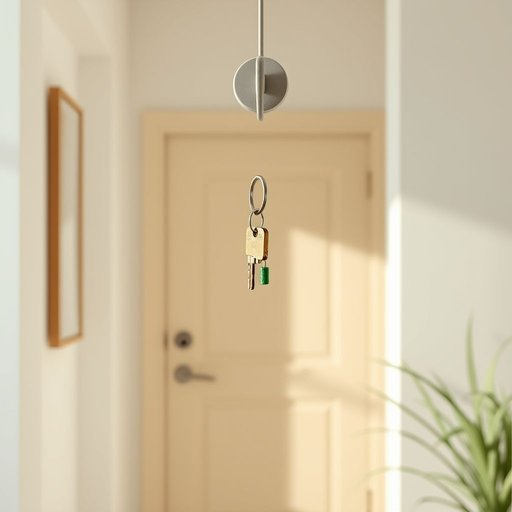

# key

<h1 style="font-size: 2.5em; font-weight: 300; letter-spacing: 2px; margin: 0; color: #2c3e50;">
/ki/
</h1>

---

---

## 例句

Could you please check if the key that’s hanging on the hook near the front door, the one with the small green tag and the worn metal ring, is the house key I gave you last week, because I’ve searched everywhere else and still can’t find it anywhere in the living room or kitchen drawers?

*Could(/kʊd/) you(/ju/) please(/pliz/) check(/ʧɛk/) if(/ɪf/) the(/ðə/) key(/ki/) that’s(/that’s*/) hanging(/ˈhæŋɪŋ/) on(/ɔn/) the(/ðə/) hook(/hʊk/) near(/nɪr/) the(/ðə/) front(/frənt/) door,(/dɔr,/) the(/ðə/) one(/wən/) with(/wɪθ/) the(/ðə/) small(/smɔl/) green(/grin/) tag(/tæg/) and(/ənd/) the(/ðə/) worn(/wɔrn/) metal(/ˈmɛtəl/) ring,(/rɪŋ,/) is(/ɪz/) the(/ðə/) house(/haʊs/) key(/ki/) I(/aɪ/) gave(/geɪv/) you(/ju/) last(/læst/) week,(/wik,/) because(/bɪˈkəz/) I’ve(/i’ve*/) searched(/sərʧt/) everywhere(/ˈɛvriˌwɛr/) else(/ɛls/) and(/ənd/) still(/stɪl/) can’t(/can’t*/) find(/faɪnd/) it(/ɪt/) anywhere(/ˈɛniˌwɛr/) in(/ɪn/) the(/ðə/) living(/ˈlɪvɪŋ/) room(/rum/) or(/ər/) kitchen(/ˈkɪʧən/) drawers?(/drɔrz?/)*

**翻译：** 请你帮我确认一下，挂在门前钩子上的那把钥匙——带有小绿标签和磨损金属环的那一把——是不是我上周给你的房门钥匙？因为我已经在客厅和厨房的抽屉里翻遍了，却始终找不到它。

---

## 解释

英语单词“key”作为名词在家居生活用品的语境中，主要指用于开锁的“钥匙”，常用以开启门锁、家具锁或其他锁具。具体使用场合通常是描述进入房屋、保险柜、抽屉或其他带锁物品时所需的金属小工具，例如“house key”（房门钥匙），“car key”（车钥匙）等。学习者需要注意，“key”作为可数名词，可以有复数形式“keys”，且常与动词“use”、“have”、“lose”等搭配，表达使用、持有或丢失钥匙的动作。在结构上，常见短语有“lock and key”（锁与钥匙），强调安全性；“key ring”（钥匙环），指用来挂钥匙的小环。词源上，“key”来自古英语“cæg”，意味针状物，引申为能开锁的小工具，说明其功能性起源。中文环境中，“key”对应的准确翻译是“钥匙”，指一种用于开启锁的金属制品，含义明确且无褒贬色彩，但在文化内涵上也象征着“开启、安全、入口”的意义，用于比喻时有“关键、要点”的含义，需要根据上下文区分。总的来说，“key”在家居用品语境中是基础且实用的词汇，掌握其语法用法和常见搭配，有助于英语交流的准确无误。

---

<small style="color: #999; font-size: 0.9em;">2025-07-17 06:22:40</small>

