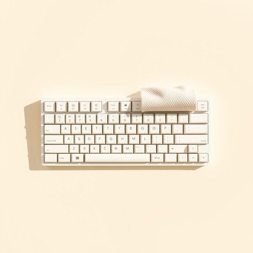

# keyboard

<h1 style="font-size: 2.5em; font-weight: 300; letter-spacing: 2px; margin: 0; color: #2c3e50;">
/ˈkiˌbɔrd/
</h1>

---

---

## 例句

Although the keyboard, which had been accidentally spilled with tea just yesterday, still functioned surprisingly well, I decided to carefully clean every key and the surrounding frame to prevent any long-term damage that might affect my evening work.

*Although(/ˌɔlˈðoʊ/) the(/ðə/) keyboard,(/ˈkiˌbɔrd,/) which(/wɪʧ/) had(/hæd/) been(/bɪn/) accidentally(/ˌæksəˈdɛnəli/) spilled(/spɪld/) with(/wɪθ/) tea(/ti/) just(/ʤɪst/) yesterday,(/ˈjɛstərˌdeɪ,/) still(/stɪl/) functioned(/ˈfəŋkʃənd/) surprisingly(/səˈpraɪzɪŋli/) well,(/wɛl,/) I(/aɪ/) decided(/ˌdɪˈsaɪdɪd/) to(/tɪ/) carefully(/ˈkɛrfəli/) clean(/klin/) every(/ˈɛvəri/) key(/ki/) and(/ənd/) the(/ðə/) surrounding(/sərˈaʊndɪŋ/) frame(/freɪm/) to(/tɪ/) prevent(/prɪˈvɛnt/) any(/ˈɛni/) long-term(/ˈlɔŋˈtərm/) damage(/ˈdæmɪʤ/) that(/ðət/) might(/maɪt/) affect(/əˈfɛkt/) my(/maɪ/) evening(/ˈivnɪŋ/) work.(/wərk./)*

**翻译：** 尽管昨天不小心将茶水洒在键盘上，它依然出乎意料地运行良好，但为了防止可能影响我晚间工作的长期损害，我还是决定仔细清洁每一个按键及其周围的框架。

---

## 解释

英语单词"keyboard"作为名词，在家居生活用品的语境中通常指的是电脑或电子设备上的键盘，是用户通过按键输入信息的装置，常见于办公、学习、娱乐等场合。学习者在使用"keyboard"时应注意其可数用法，通常复数形式为"keyboards"，且常与动词“use”、“type on”或短语“computer keyboard”、“musical keyboard”（电子琴键盘）等搭配。此外，"keyboard"不仅仅指电脑键盘，还包括钢琴、电子琴等乐器的键盘，具体需根据上下文区分。在词源上，"keyboard"由“key”（键）和“board”（板、块）构成，最初指键盘状的板面，延伸为按键装置。中文中，"keyboard"一般翻译为“键盘”，这是较为准确和通用的对应词，既指电脑键盘，也可指乐器键盘，没有褒贬色彩，属于中性词汇。总体来看，"keyboard"在家居和日常生活中广泛存在，是现代数字生活的重要组成部分，理解其具体语境尤为重要。

---

<small style="color: #999; font-size: 0.9em;">2025-07-17 06:22:40</small>

