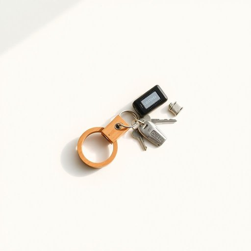

# keyring

<h1 style="font-size: 2.5em; font-weight: 300; letter-spacing: 2px; margin: 0; color: #2c3e50;">
/keyring*/
</h1>

---

---

## 例句

Could you please check the kitchen drawer for my keyring, which usually holds not only the house and car keys but also a small flashlight and a few decorative charms that my sister gave me last Christmas?

*Could(/kʊd/) you(/ju/) please(/pliz/) check(/ʧɛk/) the(/ðə/) kitchen(/ˈkɪʧən/) drawer(/drɔr/) for(/fər/) my(/maɪ/) keyring,(/keyring*,/) which(/wɪʧ/) usually(/ˈjuʒəwəli/) holds(/hoʊldz/) not(/nɑt/) only(/ˈoʊnli/) the(/ðə/) house(/haʊs/) and(/ənd/) car(/kɑr/) keys(/kiz/) but(/bət/) also(/ˈɔlsoʊ/) a(/ə/) small(/smɔl/) flashlight(/ˈflæʃˌlaɪt/) and(/ənd/) a(/ə/) few(/fju/) decorative(/ˈdɛkrətɪv/) charms(/ʧɑrmz/) that(/ðət/) my(/maɪ/) sister(/ˈsɪstər/) gave(/geɪv/) me(/mi/) last(/læst/) Christmas?(/ˈkrɪsməs?/)*

**翻译：** 你能帮我在厨房的抽屉里找一下我的钥匙圈吗？那个钥匙圈不仅通常放着房门钥匙和车钥匙，还带着一个小手电筒以及几枚我去年圣诞节时妹妹送给我的小饰品。

---

## 解释

英语单词“keyring”作为名词，指的是一种专门用来串联和携带钥匙的小环或小链，常见于家居生活用品中，便于整理和防止钥匙丢失。具体使用场合通常是在谈论钥匙的存放、家居收纳或外出时携带钥匙时，比如“Please put your keys on the keyring”（请把钥匙放在钥匙圈上）。英语学习者在使用时应注意“keyring”作为可数名词，可以用复数形式“keyrings”，且常与具体的量词搭配，如“a keyring”，“two keyrings”；在表达技巧上，常见搭配有“metal keyring”（金属钥匙圈）、“decorative keyring”（装饰性钥匙圈）等，强调材质或功能。该词源于“key”（钥匙）和“ring”（环）的复合构词，起源于日常生活中用来挂钥匙的小环物件，反映了其功能性和实用性，没有特殊的褒贬色彩，也无文化禁忌，属于中性词。在中文语境中，“keyring”准确翻译为“钥匙圈”或“钥匙扣”，均指用于串钥匙的环扣物，通常理解为家居生活中的常见收纳工具，强调其便携和整理钥匙的实用价值。

---

<small style="color: #999; font-size: 0.9em;">2025-07-17 06:22:40</small>

