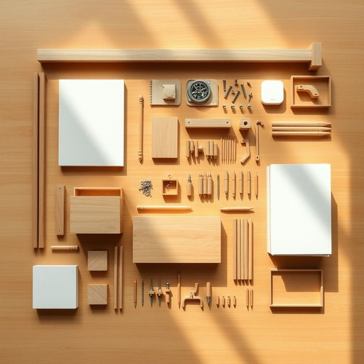

# kit

<h1 style="font-size: 2.5em; font-weight: 300; letter-spacing: 2px; margin: 0; color: #2c3e50;">
/kɪt/
</h1>

---

---

## 例句

Before you start assembling the new cabinet, make sure you have the complete flat-pack furniture kit, including all the screws, dowels, and the instruction manual, because missing even a single component could delay the entire process and make it far more frustrating than it needs to be.

*Before(/ˌbiˈfɔr/) you(/ju/) start(/stɑrt/) assembling(/əˈsɛmbəlɪŋ/) the(/ðə/) new(/nu/) cabinet,(/ˈkæbənət,/) make(/meɪk/) sure(/ʃʊr/) you(/ju/) have(/hæv/) the(/ðə/) complete(/kəmˈplit/) flat-pack(/flat-pack*/) furniture(/ˈfərnɪʧər/) kit,(/kɪt,/) including(/ˌɪnˈkludɪŋ/) all(/ɔl/) the(/ðə/) screws,(/skruz,/) dowels,(/daʊəlz,/) and(/ənd/) the(/ðə/) instruction(/ˌɪnˈstrəkʃən/) manual,(/ˈmænjuəl,/) because(/bɪˈkəz/) missing(/ˈmɪsɪŋ/) even(/ˈivɪn/) a(/ə/) single(/ˈsɪŋgəl/) component(/kəmˈpoʊnənt/) could(/kʊd/) delay(/dɪˈleɪ/) the(/ðə/) entire(/ɪnˈtaɪər/) process(/ˈprɔˌsɛs/) and(/ənd/) make(/meɪk/) it(/ɪt/) far(/fɑr/) more(/mɔr/) frustrating(/ˈfrəˌstreɪtɪŋ/) than(/ðən/) it(/ɪt/) needs(/nidz/) to(/tɪ/) be.(/bi./)*

**翻译：** 在开始组装新柜子之前，请确保您已准备齐全所有平板家具套件，包括所有螺丝、木钉及说明书，因为缺少任何一个部件都可能延误整个过程，并使组装变得比预期更加令人沮丧。

---

## 解释

英语单词“kit”在家居生活用品场景中作为名词，通常指一套成套的工具、材料或用品，便于完成某项任务或使用某种设备。具体使用场合多见于家庭DIY修理包、护理包、缝纫包、急救包等场景，比如“first aid kit”（急救包）、“sewing kit”（缝纫包）或“tool kit”（工具箱），这些都是包含若干相关物品的组合，便于用户一次性获取所需全部物品。英语学习者在使用“kit”时需注意其数的变化，一般为可数名词，复数形式为“kits”，且常见搭配多为“a kit of + 名词”或“a + 形容词 + kit”如“a survival kit”；另外，“kit”还可以作为动词使用，表示装备、配备，但在家居生活用品语境中更常见作为名词。词源方面，“kit”来源于中古英语，意指一套小型的装备或箱子，最初与船员和士兵的私人物品包有关，后引申为任何成套的小物品组合。中文语境中，“kit”多译为“套件”“工具包”或“组合包”，强调的是其成套性和便捷性，无明显褒贬含义，但因指物理成套物品，通常带有实用、便捷的积极色彩。在家居生活用品领域，理解“kit”即指一系列配备齐全、便于使用的用品套装，有助于准确把握其功能和使用场景。

---

<small style="color: #999; font-size: 0.9em;">2025-07-17 06:22:40</small>

