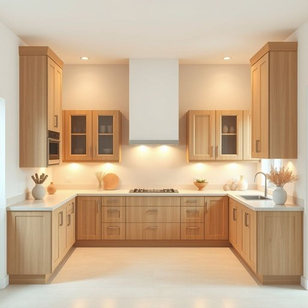

# kitchen

<h1 style="font-size: 2.5em; font-weight: 300; letter-spacing: 2px; margin: 0; color: #2c3e50;">
/ˈkɪʧən/
</h1>

---

---

## 例句

After spending nearly an hour organising the cupboards and tidying the countertops, she finally felt satisfied with how the kitchen, which had been cluttered and chaotic all morning, looked inviting and ready for her guests to enjoy the homemade meals she was preparing.

*After(/ˈæftər/) spending(/ˈspɛndɪŋ/) nearly(/ˈnɪrli/) an(/ən/) hour(/aʊər/) organising(/organising*/) the(/ðə/) cupboards(/ˈkəbərdz/) and(/ənd/) tidying(/tidying*/) the(/ðə/) countertops,(/ˈkaʊntərˌtɑps,/) she(/ʃi/) finally(/ˈfaɪnəli/) felt(/fɛlt/) satisfied(/ˈsætɪsˌfaɪd/) with(/wɪθ/) how(/haʊ/) the(/ðə/) kitchen,(/ˈkɪʧən,/) which(/wɪʧ/) had(/hæd/) been(/bɪn/) cluttered(/ˈklətərd/) and(/ənd/) chaotic(/keɪˈɑtɪk/) all(/ɔl/) morning,(/ˈmɔrnɪŋ,/) looked(/lʊkt/) inviting(/ˌɪnˈvaɪtɪŋ/) and(/ənd/) ready(/ˈrɛdi/) for(/fər/) her(/hər/) guests(/gɛsts/) to(/tɪ/) enjoy(/ˌɛnˈʤɔɪ/) the(/ðə/) homemade(/ˈhoʊˈmeɪd/) meals(/milz/) she(/ʃi/) was(/wɑz/) preparing.(/pərˈpɛrɪŋ./)*

**翻译：** 花了将近一个小时整理橱柜和清理台面后，她终于对厨房的模样感到满意。整个早晨杂乱无章的厨房此刻显得温馨而整洁，仿佛在邀请客人们品尝她精心准备的家常菜。

---

## 解释

kitchen作为名词，主要指家庭或其他建筑中用于烹饪和准备食物的房间或区域，具体使用场合多见于描述家居环境、日常生活用品或餐饮设施时，例如谈论厨房里有新的炉灶或在厨房准备晚餐。英语学习者在使用kitchen时需注意它是可数名词，通常前面可加冠词如a kitchen, the kitchen，且常与厨房用具如kitchen utensils、厨房电器kitchen appliances等词搭配，表达厨房相关的内容时也常见短语如kitchen sink厨房水槽、kitchen table厨房餐桌等；此外，kitchen还可用作复合词的组成部分，如kitchenware厨房用具、kitchenette小厨房。词源方面，kitchen源自古英语cycene，进一步源自拉丁语coquina，含义与烹饪密切相关，反映了其作为食品制作场所的历史背景。在中文语境中，kitchen准确翻译为厨房，指家庭或餐厅中专门烹饪食物的房间，没有褒贬色彩，属于中性词，文化内涵上体现出生活起居的重要场所。因此，理解kitchen不仅是一个物理空间的名称，也是日常生活中与饮食密切相关的基本概念。

---

<small style="color: #999; font-size: 0.9em;">2025-07-17 06:22:40</small>

