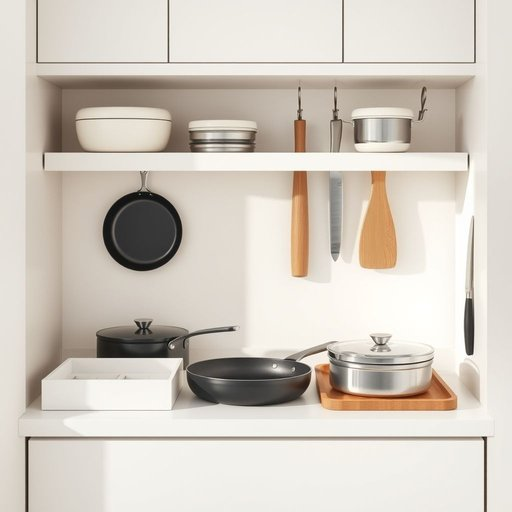

# kitchenware

<h1 style="font-size: 2.5em; font-weight: 300; letter-spacing: 2px; margin: 0; color: #2c3e50;">
/ˈkɪʧənˌwɛr/
</h1>

---

---

## 例句

Before we unpack the new kitchenware we bought during the sale, which includes everything from non-stick pans and insulated storage containers to a high-quality set of knives that the chef recommended, could you please double-check if we have enough drawer organizers and hooks to keep everything neatly arranged in the limited space of our kitchen?

*Before(/ˌbiˈfɔr/) we(/wi/) unpack(/ənˈpæk/) the(/ðə/) new(/nu/) kitchenware(/ˈkɪʧənˌwɛr/) we(/wi/) bought(/bɔt/) during(/ˈdʊrɪŋ/) the(/ðə/) sale,(/seɪl,/) which(/wɪʧ/) includes(/ˌɪnˈkludz/) everything(/ˈɛvriˌθɪŋ/) from(/frəm/) non-stick(/nɑnˈstɪk/) pans(/pænz/) and(/ənd/) insulated(/ˈɪnsəˌleɪtɪd/) storage(/ˈstɔrɪʤ/) containers(/kənˈteɪnərz/) to(/tɪ/) a(/ə/) high-quality(/ˌhaɪkˈwɑləti/) set(/sɛt/) of(/əv/) knives(/naɪvz/) that(/ðət/) the(/ðə/) chef(/ʃɛf/) recommended,(/ˌrɛkəˈmɛndɪd,/) could(/kʊd/) you(/ju/) please(/pliz/) double-check(/ˈdəbəˌlʧɛk/) if(/ɪf/) we(/wi/) have(/hæv/) enough(/ɪˈnəf/) drawer(/drɔr/) organizers(/ˈɔrgəˌnaɪzərz/) and(/ənd/) hooks(/hʊks/) to(/tɪ/) keep(/kip/) everything(/ˈɛvriˌθɪŋ/) neatly(/ˈnitli/) arranged(/əreɪnʤd/) in(/ɪn/) the(/ðə/) limited(/ˈlɪmɪtɪd/) space(/speɪs/) of(/əv/) our(/ɑr/) kitchen?(/ˈkɪʧən?/)*

**翻译：** 在我们拆开这次促销期间购买的新厨具之前，其中包括不粘锅、保温储物容器以及厨师推荐的一套高品质刀具，你能否帮忙再确认一下，我们是否有足够的抽屉收纳盒和挂钩，以便在我们厨房有限的空间里将一切整齐收纳？

---

## 解释

英语单词kitchenware作为名词，在家居生活用品的语境中指的是厨房用具，即日常烹饪和食品准备过程中所使用的各种器具和用品，如锅、碗、刀具、餐具、烤盘等。具体使用场合通常是在讨论厨房设备、餐具购买、家居布置或烹饪器材时，例如商店出售的kitchenware种类丰富，或家庭厨房中需要添置新的kitchenware。英语学习者在使用该词时需注意它为不可数名词，通常作为整体概念出现，不能直接加复数形式，但可通过上下文表达种类或数量，如a piece of kitchenware。此外，常见搭配有buy kitchenware（购买厨房用品）、kitchenware set（厨房用具套装）、stainless steel kitchenware（不锈钢厨房用具）等，表达时需注意与形容词或定语的搭配恰当，以增强描述的准确性。词源上，kitchenware复合自kitchen（厨房）和ware（制品、器具），ware源自古英语waru，意指商品或器具，组合后专指厨房相关用具，反映出实用功能与归属场所的结合。中文语境中，kitchenware准确翻译为厨房用具或厨具，其涵义较为宽泛，涵盖各种厨房操作所需的器皿和工具，不含贬义或特殊文化色彩，属于中性词汇，常用于家居生活、烹饪用品市场及相关购物场合。在表达时强调的是物品的功能属性和使用环境，便于理解和归类厨房生活用品。

---

<small style="color: #999; font-size: 0.9em;">2025-07-17 06:22:40</small>

