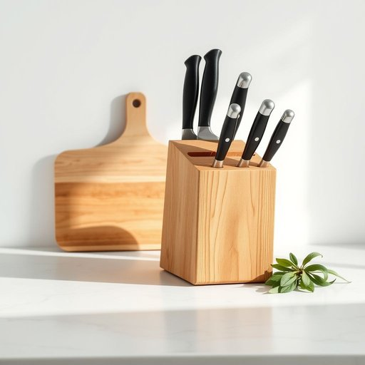

# knife-block

<h1 style="font-size: 2.5em; font-weight: 300; letter-spacing: 2px; margin: 0; color: #2c3e50;">
/knife-block*/
</h1>

---

---

## 例句

Although the new kitchen features marble countertops and state-of-the-art appliances, the importance of placing the knife-block safely near the chopping board but away from water splashes to prevent blade dulling cannot be overstated.

*Although(/ˌɔlˈðoʊ/) the(/ðə/) new(/nu/) kitchen(/ˈkɪʧən/) features(/ˈfiʧərz/) marble(/ˈmɑrbəl/) countertops(/ˈkaʊntərˌtɑps/) and(/ənd/) state-of-the-art(/ˌsteɪtəvðɪˈɑrt/) appliances,(/əˈplaɪənsɪz,/) the(/ðə/) importance(/ˌɪmˈpɔrtəns/) of(/əv/) placing(/ˈpleɪsɪŋ/) the(/ðə/) knife-block(/knife-block*/) safely(/ˈseɪfli/) near(/nɪr/) the(/ðə/) chopping(/ˈʧɑpɪŋ/) board(/bɔrd/) but(/bət/) away(/əˈweɪ/) from(/frəm/) water(/ˈwɔtər/) splashes(/ˈsplæʃɪz/) to(/tɪ/) prevent(/prɪˈvɛnt/) blade(/bleɪd/) dulling(/ˈdəlɪŋ/) cannot(/ˈkænɑt/) be(/bi/) overstated.(/ˈoʊvərˌsteɪtɪd./)*

**翻译：** 虽然新厨房配备了大理石台面和先进的电器，但将刀座安全地放置在菜板附近且远离水溅以防止刀刃钝化的重要性不可低估。

---

## 解释

knife-block作为名词指的是厨房中用来存放和排列刀具的刀架或刀座通常由木头塑料或金属制成这种物品常见于家庭厨房餐厅或烹饪场所使用时刀具插入块体中的预设孔洞既方便取用又保证刀刃安全避免直接暴露和损坏英语学习者在使用knife-block时应注意其构词结构为复合名词前半部分knife作名词修饰后半部分block指示特定用途的块状物因此整体名词约定俗成为刀架在语法上一般用作单数或复数knife-blocks且常与动词use store或place等搭配搭配时要注意不要误用为动词或拆分词组常见表达如a wooden knife-block（一只木制刀架）the knife-block holds several knives（刀架可以放几把刀）词源上knife-block源自knife（刀）与block（块块状物）组合表明其本质为用于装刀的块状物此复合构词法在英语中十分常见表示用途性质的物品名称中文语境中knife-block准确翻译为刀架或刀座强调其固定和安全存放刀具的功能避免误解为单纯的刀柄或刀片此词无明显褒贬色彩属于中性且实用的家居生活用品词汇文化内涵主要体现为厨房整理和安全意识使用时应结合具体场景表达如家庭厨房配置厨具介绍或烹饪教学等确保语义清晰准确

---

<small style="color: #999; font-size: 0.9em;">2025-07-17 06:22:40</small>

