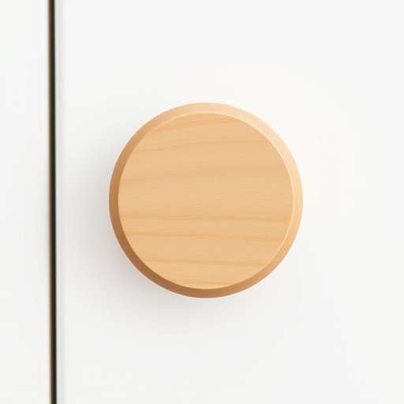

# knob

<h1 style="font-size: 2.5em; font-weight: 300; letter-spacing: 2px; margin: 0; color: #2c3e50;">
/nɑb/
</h1>

---

---

## 例句

Could you please tighten the loose knob on the kitchen cupboard, which has been wobbling every time I open it, before it falls off completely and causes the shelf to collapse under the weight of those heavy pots and pans?

*Could(/kʊd/) you(/ju/) please(/pliz/) tighten(/ˈtaɪtən/) the(/ðə/) loose(/lus/) knob(/nɑb/) on(/ɔn/) the(/ðə/) kitchen(/ˈkɪʧən/) cupboard,(/ˈkəbərd,/) which(/wɪʧ/) has(/həz/) been(/bɪn/) wobbling(/ˈwɑbəlɪŋ/) every(/ˈɛvəri/) time(/taɪm/) I(/aɪ/) open(/ˈoʊpən/) it,(/ɪt,/) before(/ˌbiˈfɔr/) it(/ɪt/) falls(/fɔlz/) off(/ɔf/) completely(/kəmˈplitli/) and(/ənd/) causes(/ˈkɔzɪz/) the(/ðə/) shelf(/ʃɛlf/) to(/tɪ/) collapse(/kəˈlæps/) under(/ˈəndər/) the(/ðə/) weight(/weɪt/) of(/əv/) those(/ðoʊz/) heavy(/ˈhɛvi/) pots(/pɑts/) and(/ənd/) pans?(/pænz?/)*

**翻译：** 请您帮忙把厨房橱柜上那个每次我打开时都会晃动的松动旋钮拧紧，免得它完全掉落，导致沉重的锅碗瓢盆压塌架子。

---

## 解释

“knob”作为名词在家居生活用品语境中通常指门、抽屉、橱柜等家具上用来开关的圆形把手或旋钮，常见于描述家庭环境中的物品，如“door knob”（门把手）或“cabinet knob”（橱柜把手）。英语学习者应注意，“knob”多用作可数名词，常见搭配有“turn the knob”（转动把手）、“loose knob”（松动的把手）、“knob on the door”等，且在句中多作名词使用，不宜混淆为动词或其他词类。词源方面，“knob”来源于中古英语knobbe，指小块、突起物，逐渐引申为家具上凸出的把手，体现了其实物的形状和功能特征。在中文语境中，“knob”精准翻译为“把手”或“旋钮”，根据具体物品选择“门把手”、“旋钮”或“手柄”等，强调其实用功能和形态特征。值得注意的是，“knob”在口语或俚语中有时带有贬义或粗俗含义，但在家居用品语境下完全中性，无褒贬色彩，学习时需根据语境辨别其使用意图。

---

<small style="color: #999; font-size: 0.9em;">2025-07-17 06:22:40</small>

