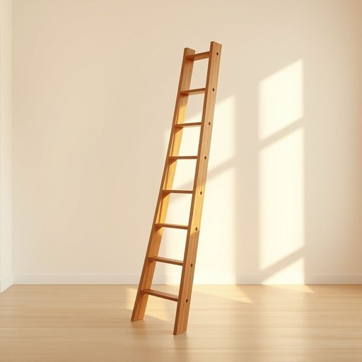

# ladder

<h1 style="font-size: 2.5em; font-weight: 300; letter-spacing: 2px; margin: 0; color: #2c3e50;">
/ˈlædər/
</h1>

---

---

## 例句

The ladder's stability was the crucial factor in completing the painting without accidents.

*The(/ðə/) ladder's(/ladder's*/) stability(/stəˈbɪlɪti/) was(/wɑz/) the(/ðə/) crucial(/ˈkruʃəl/) factor(/ˈfæktər/) in(/ɪn/) completing(/kəmˈplitɪŋ/) the(/ðə/) painting(/ˈpeɪnɪŋ/) without(/wɪˈθaʊt/) accidents.(/ˈæksədənts./)*

**翻译：** 梯子的稳定性是顺利完成这幅画且避免意外的关键因素。

---

## 解释

英语单词"ladder"在家居生活用品场景中作为名词，主要指供人攀爬的梯子，通常由两根侧杆和若干横档组成，用于达到较高位置，如更换灯泡、擦窗户或取存储架上的物品等具体使用场合。"ladder"在语法上为可数名词，常见搭配有"step ladder"（折叠梯）、"extension ladder"（伸缩梯）、"wooden ladder"（木梯）等，学习者应注意其复数形式为"ladders"，并且常与动词搭配使用，如"climb a ladder"（爬梯子）、"lean a ladder against the wall"（把梯子靠在墙上）。该词来源于古英语"hlæder"，与荷兰语"ladder"及德语"Leiter"有共同的日耳曼语系词源，反映了其古老且稳定的词义。在中文语境中，"ladder"通常准确翻译为“梯子”，是家居生活中常见实用工具，无明显褒贬色彩，使用时多指物理实体梯子，偶尔在比喻用法中也可指提升途径或阶梯，但这种用法相对较少且多见于抽象表达。整体而言，"ladder"作为家居用品名词，涵义明确，使用频率高，学习者应掌握其具体功能和搭配，避免与其他类型梯子如楼梯（stairs）混淆。

---

<small style="color: #999; font-size: 0.9em;">2025-07-17 06:22:40</small>

