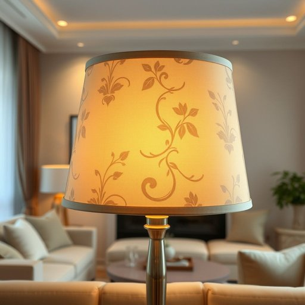

# lampshade

<h1 style="font-size: 2.5em; font-weight: 300; letter-spacing: 2px; margin: 0; color: #2c3e50;">
/lampshade*/
</h1>

---

---

## 例句

The intricate design of the lampshade, combining delicate silk patterns and vintage motifs, serves as a focal point in the living room, enhancing the ambiance and casting a warm, inviting glow during evening gatherings.

*The(/ðə/) intricate(/ˈɪntrəkət/) design(/dɪˈzaɪn/) of(/əv/) the(/ðə/) lampshade,(/lampshade*,/) combining(/kəmˈbaɪnɪŋ/) delicate(/ˈdɛləkət/) silk(/sɪlk/) patterns(/ˈpætərnz/) and(/ənd/) vintage(/ˈvɪntɪʤ/) motifs,(/moʊˈtifs,/) serves(/sərvz/) as(/ɛz/) a(/ə/) focal(/ˈfoʊkəl/) point(/pɔɪnt/) in(/ɪn/) the(/ðə/) living(/ˈlɪvɪŋ/) room,(/rum,/) enhancing(/ɛnˈhænsɪŋ/) the(/ðə/) ambiance(/ˈæmbiəns/) and(/ənd/) casting(/ˈkæstɪŋ/) a(/ə/) warm,(/wɔrm,/) inviting(/ˌɪnˈvaɪtɪŋ/) glow(/gloʊ/) during(/ˈdʊrɪŋ/) evening(/ˈivnɪŋ/) gatherings.(/ˈgæðərɪŋz./)*

**翻译：** 灯罩精巧的设计，融合了细腻的丝绸图案和复古元素，成为客厅的视觉焦点，提升了整体氛围，在夜间聚会时洒下温暖而宜人的光辉。

---

## 解释

英语单词“lampshade”作为名词，指的是覆盖在灯泡或灯具顶部，用以柔化光线、防止眩光并起装饰作用的罩子，通常由布料、纸张、塑料或金属制成，常见于家庭、办公室等室内照明环境中。在家居生活用品的语境里，lampshade多用于描述与台灯、落地灯、吊灯等灯具配套的部分，例如“a blue lampshade”（一个蓝色的灯罩）或“replace the lampshade”（更换灯罩）。学习英语的使用者在语法上应注意lampshade是可数名词，复数形式为lampshades，通常与形容词或材质类别连用，常见搭配包括“fabric lampshade”（布料灯罩）、“decorative lampshade”（装饰性灯罩）以及“lampshade holder”（灯罩支架）等。在表达技巧方面，可运用lampshade突出某个灯具有别致或复古风格，也能在描述光线效果时提及其柔和或扩散作用。词源方面，“lampshade”由lamp（灯）和shade（遮光物）组成，起源于19世纪工业革命后室内照明普及时期，强调灯具上为防止直接灯光刺眼而设计的遮光构件。中文语境中，“lampshade”准确翻译为“灯罩”，指家用或办公灯具上覆盖灯泡起装饰和调节光线功能的罩子，其含义较为中性，无褒贬色彩或特殊文化内涵，只是生活中常见的实用物件，理解时应侧重其实用与装饰双重属性。

---

<small style="color: #999; font-size: 0.9em;">2025-07-17 06:22:40</small>

