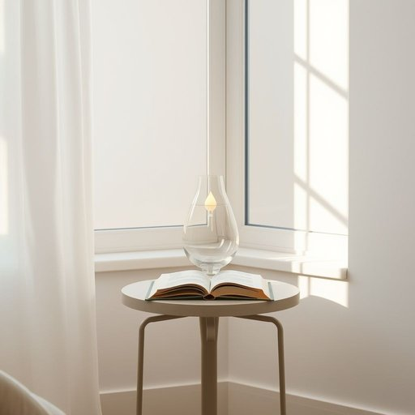

# lampstand

<h1 style="font-size: 2.5em; font-weight: 300; letter-spacing: 2px; margin: 0; color: #2c3e50;">
/lampstand*/
</h1>

---

---

## 例句

The lampstand, an intricate artifact crafted from delicate glass, stood prominently in the corner next to the sofa, where its exposure to harsh sunlight threatened to diminish its vibrant colors, prompting a careful relocation to the side table by the window to preserve its ambient glow during evening reading sessions.

*The(/ðə/) lampstand,(/lampstand*,/) an(/ən/) intricate(/ˈɪntrəkət/) artifact(/ˈɑrtəˌfækt/) crafted(/ˈkræftɪd/) from(/frəm/) delicate(/ˈdɛləkət/) glass,(/glæs,/) stood(/stʊd/) prominently(/ˈprɑmənəntli/) in(/ɪn/) the(/ðə/) corner(/ˈkɔrnər/) next(/nɛkst/) to(/tɪ/) the(/ðə/) sofa,(/ˈsoʊfə,/) where(/wɛr/) its(/ɪts/) exposure(/ɪkˈspoʊʒər/) to(/tɪ/) harsh(/hɑrʃ/) sunlight(/ˈsənˌlaɪt/) threatened(/θˈrɛtənd/) to(/tɪ/) diminish(/dɪˈmɪnɪʃ/) its(/ɪts/) vibrant(/ˈvaɪbrənt/) colors,(/ˈkələrz,/) prompting(/ˈprɑmptɪŋ/) a(/ə/) careful(/ˈkɛrfəl/) relocation(/ˌriˈloʊˈkeɪʃən/) to(/tɪ/) the(/ðə/) side(/saɪd/) table(/ˈteɪbəl/) by(/baɪ/) the(/ðə/) window(/ˈwɪndoʊ/) to(/tɪ/) preserve(/prɪˈzərv/) its(/ɪts/) ambient(/ˈæmbiənt/) glow(/gloʊ/) during(/ˈdʊrɪŋ/) evening(/ˈivnɪŋ/) reading(/ˈrɛdɪŋ/) sessions.(/ˈsɛʃənz./)*

**翻译：** 这盏灯饰由细腻的玻璃精巧制成，显眼地矗立在沙发旁的角落，因暴露在强烈阳光下，其鲜艳的色彩岌岌可危，遂被小心移至窗边的边桌，以保护其温润的光辉，伴随夜晚的阅读时光。

---

## 解释

lampstand作为名词，主要指支撑灯具的底座或灯座，通常用于放置台灯或落地灯，使灯具稳固立于桌面或地面。在家居生活用品的语境中，lampstand多出现在描述家居摆设或照明设备时，比如放在书桌上的lampstand或客厅角落的落地lampstand。英语学习者在使用时需注意，lampstand通常指的是灯的支撑部分，而不是灯泡或灯罩，因此不能与lamp直接混用，通常与light或lamp配合使用，如a lampstand with a lampshade。语法上作为可数名词，复数形式为lampstands，且常用作具体物品的称谓。此外，lampstand一词起源于lamp（灯）和stand（支架、底座）两个词的组合，强调功能性支撑作用，源自中世纪英语，意指专门用于安置灯具的支架。中文中准确翻译为灯座或灯台，具体含义依使用情景而异，既可指桌灯的底座，也可引申为较大或装饰性较强的落地灯支架。此词在中文家居语境中较为中性，无明显褒贬含义或特殊文化色彩，主要体现其实用和装饰功能。总之，lampstand在日常英语表达中是一个明确指代灯具支撑部分的专业词汇，准确使用能帮助学习者更精确地描述灯具结构及家居照明配置。

---

<small style="color: #999; font-size: 0.9em;">2025-07-17 06:22:40</small>

