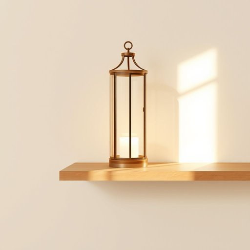

# lantern

<h1 style="font-size: 2.5em; font-weight: 300; letter-spacing: 2px; margin: 0; color: #2c3e50;">
/ˈlæntərn/
</h1>

---

---

## 例句

The decorative lantern on the shelf by the window, featuring intricate metalwork and frosted glass panels, creates a cozy atmosphere in the living room when lit before guests arrive.

*The(/ðə/) decorative(/ˈdɛkrətɪv/) lantern(/ˈlæntərn/) on(/ɔn/) the(/ðə/) shelf(/ʃɛlf/) by(/baɪ/) the(/ðə/) window,(/ˈwɪndoʊ,/) featuring(/ˈfiʧərɪŋ/) intricate(/ˈɪntrəkət/) metalwork(/ˈmɛtəlˌwərk/) and(/ənd/) frosted(/ˈfrɔstɪd/) glass(/glæs/) panels,(/ˈpænəlz,/) creates(/kriˈeɪts/) a(/ə/) cozy(/ˈkoʊzi/) atmosphere(/ˈætməsˌfɪr/) in(/ɪn/) the(/ðə/) living(/ˈlɪvɪŋ/) room(/rum/) when(/wɪn/) lit(/lɪt/) before(/ˌbiˈfɔr/) guests(/gɛsts/) arrive.(/əraɪv./)*

**翻译：** 窗边书架上的装饰灯笼，饰以精致的金属工艺和磨砂玻璃面板，在客人到来之前点亮时，为客厅营造出温馨的氛围。

---

## 解释

“lantern”作为名词在家居生活用品的语境中，通常指一种用来照明的便携式装置，内部装有光源（例如蜡烛、油灯或电灯泡）并由透明材料（如玻璃）包裹，以防风雨影响火焰或光源，常用于室内外照明、露营、庭院装饰或应急备用照明。英语学习者在使用“lantern”时应注意它是可数名词，常见搭配有“carrying a lantern”（提着灯笼）、“a paper lantern”（纸灯笼）、“a lantern light”（灯笼光）等，此外，“lantern”多用于具体实物指代，且不可用作复数时表示抽象概念；其常见表达还有“lantern festival”（灯笼节），但此处更多是文化专有名词。词源上，“lantern”源自中古英语“lanterne”，进一步源自法语“lanterne”，而法语又源自拉丁语“lanterna”，该词本身可能与古希腊语的“lampter”（灯）有关，体现了灯具的演变历史。从中文角度理解，“lantern”准确翻译为“灯笼”或“提灯”，强调一种带壳体、内含光源的便携照明工具，区别于普通的“灯”或“灯泡”。在文化层面，“lantern”在西方多与传统照明和户外活动相关，而在中文语境中“灯笼”则不仅是照明工具，更具有节庆装饰和象征吉祥的文化内涵，需注意其使用环境和内涵区别，无明显褒贬色彩，但在诗歌、文学中灯笼常被赋予温馨、引导或希望的意象。

---

<small style="color: #999; font-size: 0.9em;">2025-07-17 06:22:40</small>

