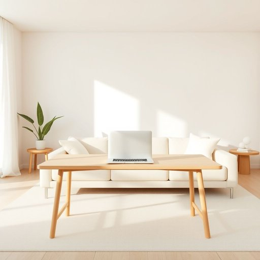

# laptop

<h1 style="font-size: 2.5em; font-weight: 300; letter-spacing: 2px; margin: 0; color: #2c3e50;">
/ˈlæpˌtɑp/
</h1>

---

---

## 例句

After finishing his breakfast, James carried his laptop—whose battery life had surprisingly lasted through the entire weekend without needing a charge—over to the living room sofa, where he planned to catch up on work emails and stream a documentary before the kids woke up.

*After(/ˈæftər/) finishing(/ˈfɪnɪʃɪŋ/) his(/hɪz/) breakfast,(/ˈbrɛkfəst,/) James(/ʤeɪmz/) carried(/ˈkɛrid/) his(/hɪz/) laptop—whose(/laptop—whose*/) battery(/ˈbætəri/) life(/laɪf/) had(/hæd/) surprisingly(/səˈpraɪzɪŋli/) lasted(/ˈlæstɪd/) through(/θru/) the(/ðə/) entire(/ɪnˈtaɪər/) weekend(/ˈwiˌkɪnd/) without(/wɪˈθaʊt/) needing(/ˈnidɪŋ/) a(/ə/) charge—over(/charge—over*/) to(/tɪ/) the(/ðə/) living(/ˈlɪvɪŋ/) room(/rum/) sofa,(/ˈsoʊfə,/) where(/wɛr/) he(/hi/) planned(/plænd/) to(/tɪ/) catch(/kæʧ/) up(/əp/) on(/ɔn/) work(/wərk/) emails(/iˈmeɪlz/) and(/ənd/) stream(/strim/) a(/ə/) documentary(/ˌdɑkjəˈmɛnəri/) before(/ˌbiˈfɔr/) the(/ðə/) kids(/kɪdz/) woke(/woʊk/) up.(/əp./)*

**翻译：** 吃完早餐后，詹姆斯拿着笔记本电脑——电池竟然惊人地坚持了整个周末都未曾充电——走到客厅沙发上，打算趁孩子们醒来前处理工作邮件并观看一部纪录片。

---

## 解释

英文单词“laptop”作为名词在家居生活用品的语境中通常指便携式个人计算机，即“笔记本电脑”。它常用于描述一种轻便、小巧、便于携带，适合在家中或其他非固定场所使用的电脑设备，适合学习、办公、娱乐等活动。英语学习者在使用“laptop”时需注意该词为可数名词，通常前面可加不定冠词a，如a laptop，且常与动词搭配使用，如“use a laptop”（使用笔记本电脑）、“buy a laptop”（购买笔记本电脑）。它也常与形容词连用，如“portable laptop”（便携笔记本）或与品牌型号搭配，如“a Dell laptop”。“Laptop”源自“lap”（膝盖）和“top”（顶部）合成，意指这种电脑设计初衷是在膝上使用，体现轻便和移动特性。在中文语境中，“laptop”准确翻译为“笔记本电脑”或简称“笔记本”，强调其便携和轻巧属性。该词本身无明显褒贬色彩，属于中性词汇，常见于生活、学习、办公等多种正面语境，在日常交流中较为常用且普遍接受，无特殊文化内涵。

---

<small style="color: #999; font-size: 0.9em;">2025-07-17 06:22:40</small>

