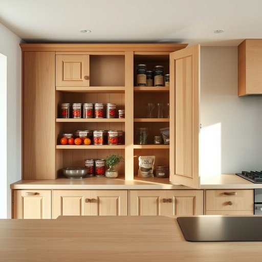

# larder

<h1 style="font-size: 2.5em; font-weight: 300; letter-spacing: 2px; margin: 0; color: #2c3e50;">
/ˈlɑrdər/
</h1>

---

---

## 例句

Before we start cooking dinner, the larder must be checked to ensure it contains any tinned tomatoes or dried herbs, as their absence would prevent the sauce from having the rich flavour that makes it so delicious.

*Before(/ˌbiˈfɔr/) we(/wi/) start(/stɑrt/) cooking(/ˈkʊkɪŋ/) dinner,(/ˈdɪnər,/) the(/ðə/) larder(/ˈlɑrdər/) must(/məst/) be(/bi/) checked(/ʧɛkt/) to(/tɪ/) ensure(/ɪnˈʃʊr/) it(/ɪt/) contains(/kənˈteɪnz/) any(/ˈɛni/) tinned(/tinned*/) tomatoes(/təˈmɑtoʊz/) or(/ər/) dried(/draɪd/) herbs,(/ərbz,/) as(/ɛz/) their(/ðɛr/) absence(/ˈæbsəns/) would(/wʊd/) prevent(/prɪˈvɛnt/) the(/ðə/) sauce(/sɔs/) from(/frəm/) having(/ˈhævɪŋ/) the(/ðə/) rich(/rɪʧ/) flavour(/flavour*/) that(/ðət/) makes(/meɪks/) it(/ɪt/) so(/soʊ/) delicious.(/dɪˈlɪʃəs./)*

**翻译：** 在开始准备晚餐之前，必须先检查储藏室，确保里面有罐装番茄或干香草，因为缺少它们，酱汁便无法拥有那种丰富且美味的风味。

---

## 解释

英语单词‘larder’作为名词，在家居生活用品的语境中，指的是专门用来储藏食品特别是易腐食材，如肉类、蔬菜和干粮的储藏室或柜子，通常位于厨房附近或家庭储藏区。它一般用于描述传统英国家庭中的储存空间，尤其在没有现代冰箱或冷藏设备时，larder是保证食物保鲜的重要场所。英语学习者在使用‘larder’时需注意它是可数名词，复数形式为‘larders’，常见搭配有‘a larder room’（储藏室）、‘cold larder’（冷藏间）以及‘put something in the larder’（把东西放入储藏室），表达上多与食品保存、厨房布局相关。这个词起源于中古英语，源自古法语‘lardier’，意指存放猪肉脂肪的地方，进一步源自拉丁语‘lardarium’，与‘lard’（猪油）密切相关，体现了其原本作为储藏猪肉脂肪的功能。中文中，‘larder’常准确翻译为“储藏室”或“食品储藏柜”，不过在现代家居语境中，可理解为“食品储藏间”或“小食品储藏室”，侧重于储存食物的专门空间。‘larder’本身无褒贬色彩，但因其传统和带有一定年代感，现代使用时可能显得有些复古或正式，较少用于日常口语，更常见于描述某些旧式或英式家庭厨房配置的场合。

---

<small style="color: #999; font-size: 0.9em;">2025-07-17 06:22:40</small>

