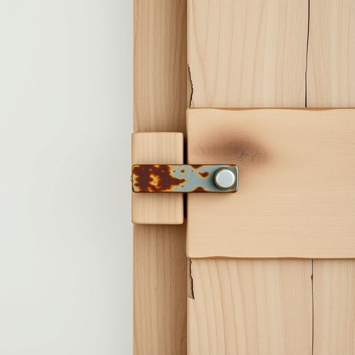

# latch

<h1 style="font-size: 2.5em; font-weight: 300; letter-spacing: 2px; margin: 0; color: #2c3e50;">
/læʧ/
</h1>

---

---

## 例句

I had to fix the old wooden gate this morning because the latch, which had rusted over time and was no longer holding the door securely, kept slipping open whenever the wind blew hard, making it necessary to replace it with a more durable one before the kids went out to play in the garden.

*I(/aɪ/) had(/hæd/) to(/tɪ/) fix(/fɪks/) the(/ðə/) old(/oʊld/) wooden(/ˈwʊdən/) gate(/geɪt/) this(/ðɪs/) morning(/ˈmɔrnɪŋ/) because(/bɪˈkəz/) the(/ðə/) latch,(/læʧ,/) which(/wɪʧ/) had(/hæd/) rusted(/ˈrəstɪd/) over(/ˈoʊvər/) time(/taɪm/) and(/ənd/) was(/wɑz/) no(/noʊ/) longer(/ˈlɔŋgər/) holding(/ˈhoʊldɪŋ/) the(/ðə/) door(/dɔr/) securely,(/sɪˈkjʊrli,/) kept(/kɛpt/) slipping(/sˈlɪpɪŋ/) open(/ˈoʊpən/) whenever(/wɛˈnɛvər/) the(/ðə/) wind(/wɪnd/) blew(/blu/) hard,(/hɑrd,/) making(/ˈmeɪkɪŋ/) it(/ɪt/) necessary(/ˈnɛsəˌsɛri/) to(/tɪ/) replace(/ˌriˈpleɪs/) it(/ɪt/) with(/wɪθ/) a(/ə/) more(/mɔr/) durable(/ˈdʊrəbəl/) one(/wən/) before(/ˌbiˈfɔr/) the(/ðə/) kids(/kɪdz/) went(/wɛnt/) out(/aʊt/) to(/tɪ/) play(/pleɪ/) in(/ɪn/) the(/ðə/) garden.(/ˈgɑrdən./)*

**翻译：** 今天早上我不得不修理那扇旧木门，因为门闩随着时间生锈，已经无法牢固地扣住门，每当风吹得很大时总会自动滑开，因此在孩子们出去花园玩耍之前，必须将其换成一个更耐用的门闩。

---

## 解释

英语单词“latch”作为名词在家居生活用品场景中，主要指门窗上的插销或闩锁，用于固定门窗，使其保持关闭状态，防止意外开启。具体使用场合通常是在描述家中门、窗、橱柜或栅栏等需要机械锁定的小装置时，例如“the door latch”（门闩）或“a window latch”（窗户插销）。英语学习者在使用“latch”时应注意它的可数名词属性，常与形容词搭配，如“metal latch”（金属闩锁）、“spring latch”（弹簧锁），或与动词“open,” “close,” “release”搭配表示动作；此外，“latch onto”作为动词短语有“抓住”或“理解”的引申义，但这与名词用法要区分开。词源方面，“latch”源自古英语“læccan”，意为“抓住”，演变为指机械抓握装置，与门锁功能相符。在中文语境中，“latch”宜译为“门闩”、“插销”或“闩锁”，强调其固定门窗的机械部件属性，无明显褒贬色彩，属于中性词汇，并常见于家庭生活描述中，反映实用且具体的家居安全或功能需求。

---

<small style="color: #999; font-size: 0.9em;">2025-07-17 06:22:40</small>

