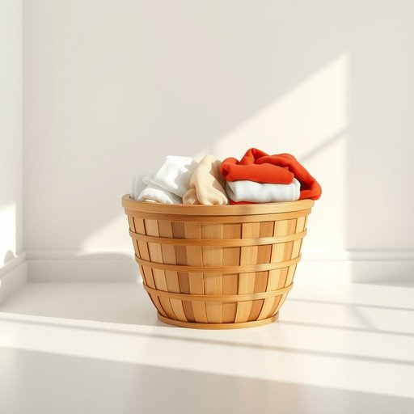

# laundry

<h1 style="font-size: 2.5em; font-weight: 300; letter-spacing: 2px; margin: 0; color: #2c3e50;">
/ˈlɔndri/
</h1>

---

---

## 例句

Once you've sorted the laundry into whites and colours, make sure to check the care labels carefully, because some of the delicate items that require hand washing or cold cycles tend to get damaged if tossed indiscriminately into the washing machine.

*Once(/wəns/) you've(/juv/) sorted(/ˈsɔrtɪd/) the(/ðə/) laundry(/ˈlɔndri/) into(/ˈɪntu/) whites(/waɪts/) and(/ənd/) colours,(/colours*,/) make(/meɪk/) sure(/ʃʊr/) to(/tɪ/) check(/ʧɛk/) the(/ðə/) care(/kɛr/) labels(/ˈleɪbəlz/) carefully,(/ˈkɛrfəli,/) because(/bɪˈkəz/) some(/səm/) of(/əv/) the(/ðə/) delicate(/ˈdɛləkət/) items(/ˈaɪtəmz/) that(/ðət/) require(/ˌrikˈwaɪər/) hand(/hænd/) washing(/ˈwɑʃɪŋ/) or(/ər/) cold(/koʊld/) cycles(/ˈsaɪkəlz/) tend(/tɛnd/) to(/tɪ/) get(/gɪt/) damaged(/ˈdæmɪʤd/) if(/ɪf/) tossed(/tɔst/) indiscriminately(/ˌɪndɪˈskrɪmənəˌtli/) into(/ˈɪntu/) the(/ðə/) washing(/ˈwɑʃɪŋ/) machine.(/məˈʃin./)*

**翻译：** 一旦你将衣物分类为白色和有色，务必仔细检查洗护标签，因为某些需要手洗或冷水洗涤的娇嫩衣物，如果随意丢进洗衣机，往往容易受损。

---

## 解释

英语单词“laundry”作为名词，在家居生活用品的语境中通常指待洗或刚洗好的衣物，尤其是指脏衣服、床单、毛巾等需要清洗的织物，使用场合多见于家庭、洗衣店或酒店等环境中。例如，“doing the laundry”表示“洗衣服”的动作，而“a laundry basket”指装放脏衣服的篮子。英语学习者需要注意，“laundry”作为不可数名词时泛指衣物总称，不用复数形式；但在某些情况下也可以用作可数名词，指具体的一批衣物或洗衣店，如“I dropped off my laundry”（我送去洗衣店）。常见搭配包括“do the laundry”（洗衣服）、“laundry room”（洗衣房）、“laundry detergent”（洗衣粉或洗衣液）等；表达时也须留意与动词搭配的正确性，如使用“do”而非“make”。词源方面，“laundry”源自中古英语“laundre”，进一步源于古法语“lavender”意指洗涤场所，根源与拉丁语“lavare”（洗）相关，体现了其与洗涤活动的紧密联系。在中文语境中，“laundry”一般准确翻译为“洗衣”、“待洗衣物”或“洗衣服”，具体含义视上下文而定，既可指衣物本身，也可指洗衣这一行为或场所。该词本身无明显褒贬色彩，文化内涵较为中性，但在某些语言习惯中，“laundry”也可能引申为“公开私人事务”（如“air one’s dirty laundry”，意为“揭露隐私”），使用时需根据语境区分。总体来看，“laundry”作为家居生活用品词汇，是日常生活中描述洗衣相关事物的基础词汇，理解其用法和搭配对英语学习者尤为重要。

---

<small style="color: #999; font-size: 0.9em;">2025-07-17 06:22:40</small>

