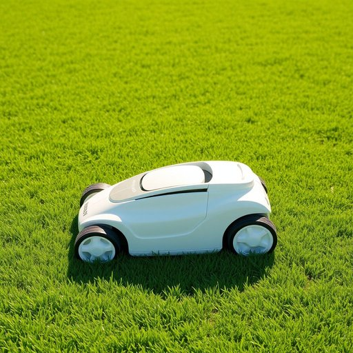

# lawnmower

<h1 style="font-size: 2.5em; font-weight: 300; letter-spacing: 2px; margin: 0; color: #2c3e50;">
/ˈlɔnmoʊər/
</h1>

---

---

## 例句

Although the lawnmower, which Dad bought last summer after our old one finally broke down, requires a bit of maintenance to keep the blades sharp and the engine running smoothly, it has made the weekly chore of cutting the sprawling garden not only much quicker but surprisingly satisfying, especially when the sun is shining and the freshly trimmed grass gives the whole yard a neat, inviting appearance.

*Although(/ˌɔlˈðoʊ/) the(/ðə/) lawnmower,(/ˈlɔnmoʊər,/) which(/wɪʧ/) Dad(/dæd/) bought(/bɔt/) last(/læst/) summer(/ˈsəmər/) after(/ˈæftər/) our(/ɑr/) old(/oʊld/) one(/wən/) finally(/ˈfaɪnəli/) broke(/broʊk/) down,(/daʊn,/) requires(/rikˈwaɪərz/) a(/ə/) bit(/bɪt/) of(/əv/) maintenance(/ˈmeɪntənəns/) to(/tɪ/) keep(/kip/) the(/ðə/) blades(/bleɪdz/) sharp(/ʃɑrp/) and(/ənd/) the(/ðə/) engine(/ˈɪnʤən/) running(/ˈrənɪŋ/) smoothly,(/sˈmuðli,/) it(/ɪt/) has(/həz/) made(/meɪd/) the(/ðə/) weekly(/ˈwikli/) chore(/ʧɔr/) of(/əv/) cutting(/ˈkətɪŋ/) the(/ðə/) sprawling(/ˈsprɔlɪŋ/) garden(/ˈgɑrdən/) not(/nɑt/) only(/ˈoʊnli/) much(/məʧ/) quicker(/kˈwɪkər/) but(/bət/) surprisingly(/səˈpraɪzɪŋli/) satisfying,(/ˈsætɪsˌfaɪɪŋ,/) especially(/əˈspɛʃəli/) when(/wɪn/) the(/ðə/) sun(/sən/) is(/ɪz/) shining(/ˈʃaɪnɪŋ/) and(/ənd/) the(/ðə/) freshly(/ˈfrɛʃli/) trimmed(/trɪmd/) grass(/græs/) gives(/gɪvz/) the(/ðə/) whole(/hoʊl/) yard(/jɑrd/) a(/ə/) neat,(/nit,/) inviting(/ˌɪnˈvaɪtɪŋ/) appearance.(/əˈpɪrəns./)*

**翻译：** 虽然爸爸去年夏天在我们旧割草机最终坏掉后买的新割草机需要一些维护以保持刀片锋利和发动机运行顺畅，但它不仅大大加快了每周修剪这片广阔花园的工作速度，而且令人意外地带来了满足感，尤其是在阳光明媚、刚修剪过的草地让整个院子显得整洁宜人时。

---

## 解释

“lawnmower”作为名词，指的是一种用于修剪草坪的工具，常见于家庭花园或公共绿地的草坪维护中，尤其在家居生活用品的语境下，它通常是电动或燃油驱动的机械设备，用来使草坪保持整洁和美观。英语学习者在使用该词时应注意其构成为复合词，由“lawn”（草坪）和“mower”（割草机）组成，通常是可数名词，单数形式为“a lawnmower”，复数形式为“lawnmowers”，常见搭配有“push lawnmower”（手推割草机）、“ride-on lawnmower”（驾驶式割草机）、“electric lawnmower”（电动割草机）等，表达时多用于描述工具的类型、功能或使用方式。词源方面，“lawnmower”起源于19世纪末，随着现代草坪文化的兴起，机械割草机的发明促进了这一词汇的产生和普及，其中“mower”源自动词“mow”（割草），而“lawn”意指经常修剪的花园草坪，合成后明确指应用于草坪的割草机。在中文语境中，“lawnmower”准确翻译为“割草机”或“草坪割草机”，强调其功能性和应用环境，属于日常生活中常见的园艺工具词汇，通常无褒贬色彩，属于中性词，文化内涵与西方对庭院绿化的重视有关，反映了一种生活品质和园艺管理的习惯。在使用时，注意根据具体类型和操作方式区分不同种类的割草机，以便表达更精准。

---

<small style="color: #999; font-size: 0.9em;">2025-07-17 06:22:40</small>

