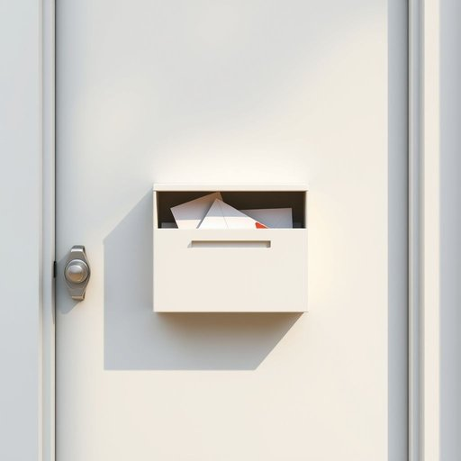

# letterbox

<h1 style="font-size: 2.5em; font-weight: 300; letter-spacing: 2px; margin: 0; color: #2c3e50;">
/letterbox*/
</h1>

---

---

## 例句

Every morning, before I leave for work, I make sure to check the letterbox, which is cleverly built into the front door and often stuffed with not only letters and bills but also unexpected parcels and flyers, ensuring I never miss an important delivery or piece of correspondence.

*Every(/ˈɛvəri/) morning,(/ˈmɔrnɪŋ,/) before(/ˌbiˈfɔr/) I(/aɪ/) leave(/liv/) for(/fər/) work,(/wərk,/) I(/aɪ/) make(/meɪk/) sure(/ʃʊr/) to(/tɪ/) check(/ʧɛk/) the(/ðə/) letterbox,(/letterbox*,/) which(/wɪʧ/) is(/ɪz/) cleverly(/ˈklɛvərli/) built(/bɪlt/) into(/ˈɪntu/) the(/ðə/) front(/frənt/) door(/dɔr/) and(/ənd/) often(/ˈɔfən/) stuffed(/stəft/) with(/wɪθ/) not(/nɑt/) only(/ˈoʊnli/) letters(/ˈlɛtərz/) and(/ənd/) bills(/bɪlz/) but(/bət/) also(/ˈɔlsoʊ/) unexpected(/ˌənɪkˈspɛktɪd/) parcels(/ˈpɑrsəlz/) and(/ənd/) flyers,(/flaɪərz,/) ensuring(/ɪnˈʃʊrɪŋ/) I(/aɪ/) never(/ˈnɛvər/) miss(/mɪs/) an(/ən/) important(/ˌɪmˈpɔrtənt/) delivery(/dɪˈlɪvəri/) or(/ər/) piece(/pis/) of(/əv/) correspondence.(/ˌkɔrəˈspɑndəns./)*

**翻译：** 每天早晨，在出门上班前，我都会仔细查看信箱。这个信箱巧妙地嵌入在前门内，常常不仅塞满了信件和账单，还有意想不到的包裹和传单，确保我不会错过任何重要的投递或来信。

---

## 解释

英语单词“letterbox”作为名词，在家居生活用品的语境中通常指安装在门上或门口，用于投递信件的狭长开口或有盖的小盒子，常见于英美等国家的住宅门上，方便邮递员直接将信件投递到屋内或门外的收信口。使用时，“letterbox”一般与表示位置的词搭配，如“door letterbox”（门上的信箱口）、“wall letterbox”（墙上的信箱），也可以与表示邮递的动词搭配，如“put letters through the letterbox”（把信放进信箱口）。在语法上，“letterbox”是可数名词，单数形式为“letterbox”，复数形式为“letterboxes”，需注意区分。该词源自英文中“letter”（信件）和“box”（盒子）的组合，直观表达其功能和形态，自维多利亚时代以来便有此设计，反映了邮政服务的需求和家庭生活配置的便利性。在中文语境中，“letterbox”准确翻译为“信箱口”或“信箱槽”，通常不泛指整个邮筒，而是特指门上或门口用于投递信件的狭缝或小盒子。该词本身无褒贬色彩，属于中性词汇，但因不同文化和住宅结构的差异，在中国日常生活中此设备不如西方普及，因此使用时需根据具体语境解释清楚，否则可能被误解为邮筒或大型收信箱。总体而言，“letterbox”作为家庭生活用品名词，强调其实用性和邮政属性，是描述住宅接收信件的重要设施词汇。

---

<small style="color: #999; font-size: 0.9em;">2025-07-17 06:22:40</small>

