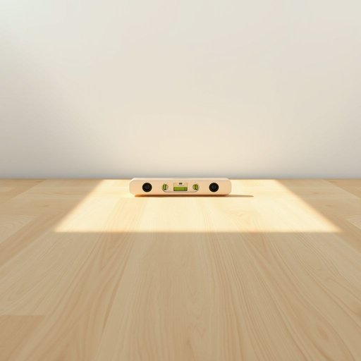

# level

<h1 style="font-size: 2.5em; font-weight: 300; letter-spacing: 2px; margin: 0; color: #2c3e50;">
/ˈlɛvəl/
</h1>

---

---

## 例句

Before the project could proceed, the architect insisted on using a spirit level to guarantee that the foundation was completely even, as any misalignment would compromise the stability and future appearance of the building.

*Before(/ˌbiˈfɔr/) the(/ðə/) project(/ˈprɑʤɛkt/) could(/kʊd/) proceed,(/pərˈsid,/) the(/ðə/) architect(/ˈɑrkəˌtɛkt/) insisted(/ˌɪnˈsɪstɪd/) on(/ɔn/) using(/ˈjuzɪŋ/) a(/ə/) spirit(/ˈspɪrɪt/) level(/ˈlɛvəl/) to(/tɪ/) guarantee(/ˌgɛrənˈti/) that(/ðət/) the(/ðə/) foundation(/faʊnˈdeɪʃən/) was(/wɑz/) completely(/kəmˈplitli/) even,(/ˈivɪn,/) as(/ɛz/) any(/ˈɛni/) misalignment(/misalignment*/) would(/wʊd/) compromise(/ˈkɑmprəˌmaɪz/) the(/ðə/) stability(/stəˈbɪlɪti/) and(/ənd/) future(/fˈjuʧər/) appearance(/əˈpɪrəns/) of(/əv/) the(/ðə/) building.(/ˈbɪldɪŋ./)*

**翻译：** 在项目启动之前，建筑师坚持使用水平仪确保地基完全平整，因为任何偏差都会影响建筑的稳定性及未来的外观。

---

## 解释

在家居生活用品的语境中，名词“level”主要指的是测量物体是否处于水平状态的工具，即“水平仪”或“水准器”，常用于安装家具、挂画或装修时确保物体平整、对齐。具体使用场合多见于描述某些工具，比如“use a level to hang the shelf”（用水平仪挂架子），“check the level of the table”（检查桌面的水平）。英语学习者在使用“level”作为名词时，要注意其数的变化（单数level，复数levels），以及与介词搭配的习惯表达，如“at level”（在水平面），“on the same level”（在同一水平）。此外，“level”还可引申为“水平、层次”，但在家居用品场景中主要指工具含义，避免混淆。该词源自拉丁语“libella”，意指小天平，后来演变为指示水平的工具，体现其测量平衡的功能。在中文语境中，“level”作为名词最准确的对应是“水平仪”或“水准器”，表达的是一种用于判定水平面的实用工具，强调其作用是保证物体表面或结构的平整度与稳定性。此词在此场景无贬义或特别的文化色彩，属于日常生活中常见的工具名词，使用时体现的是精确和专业的态度。

---

<small style="color: #999; font-size: 0.9em;">2025-07-17 06:22:40</small>

